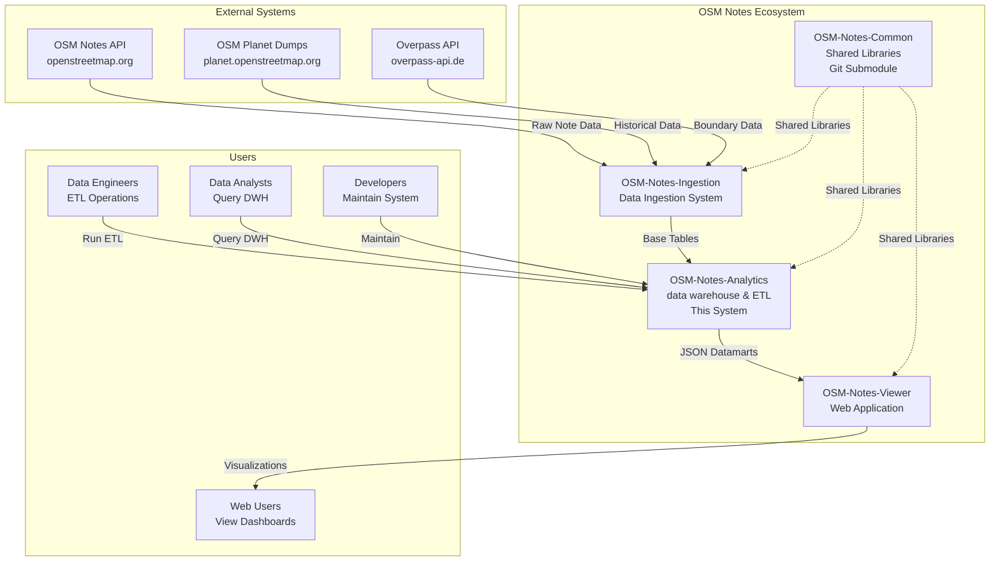
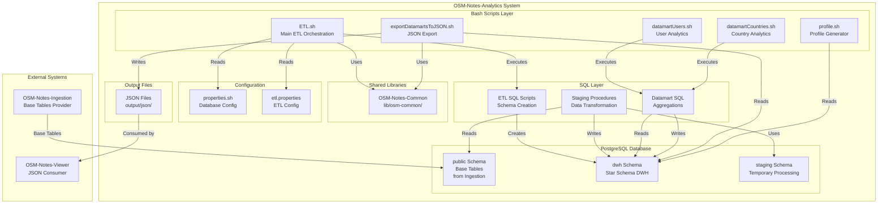
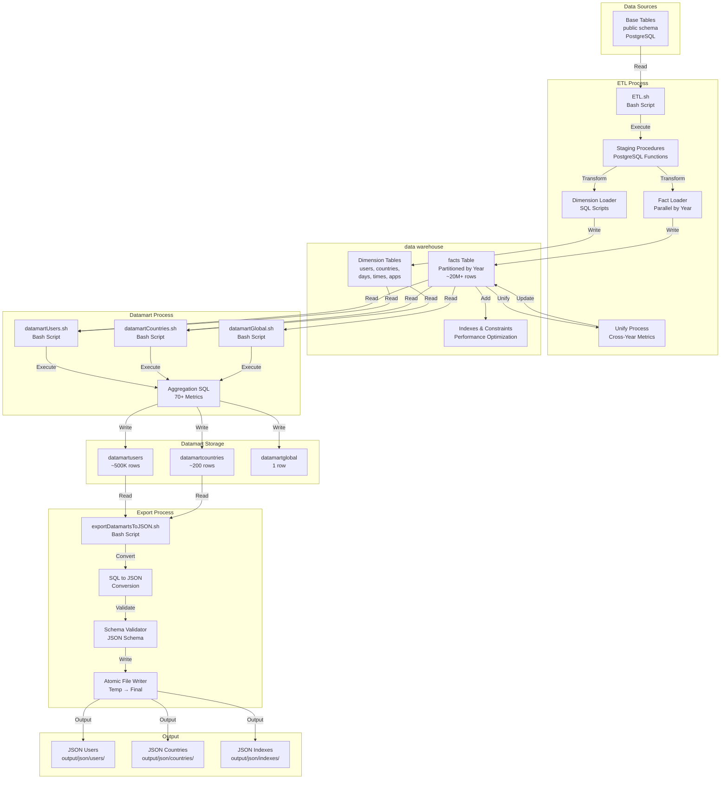
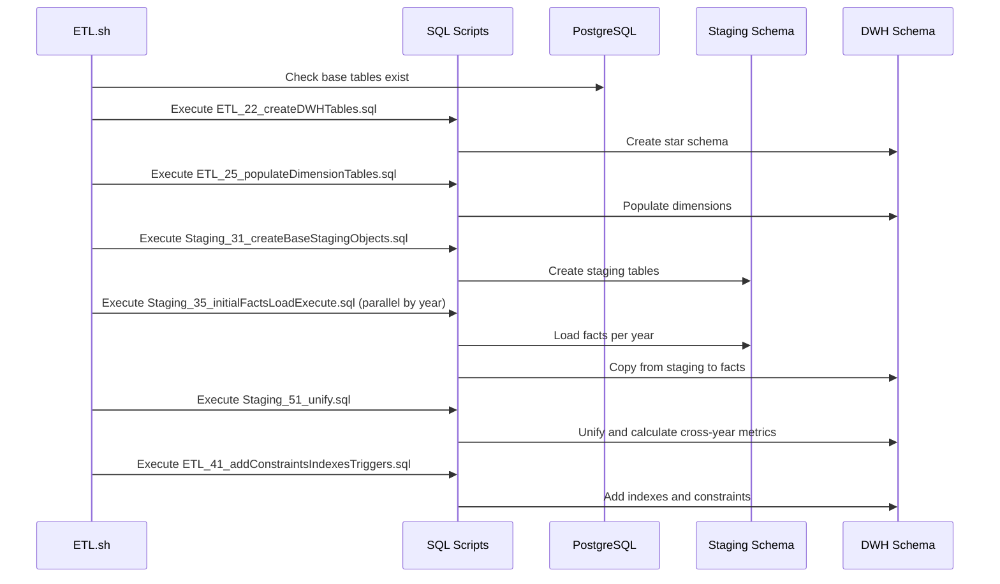
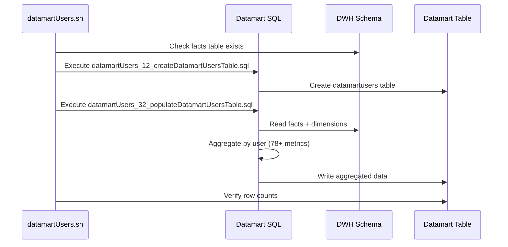
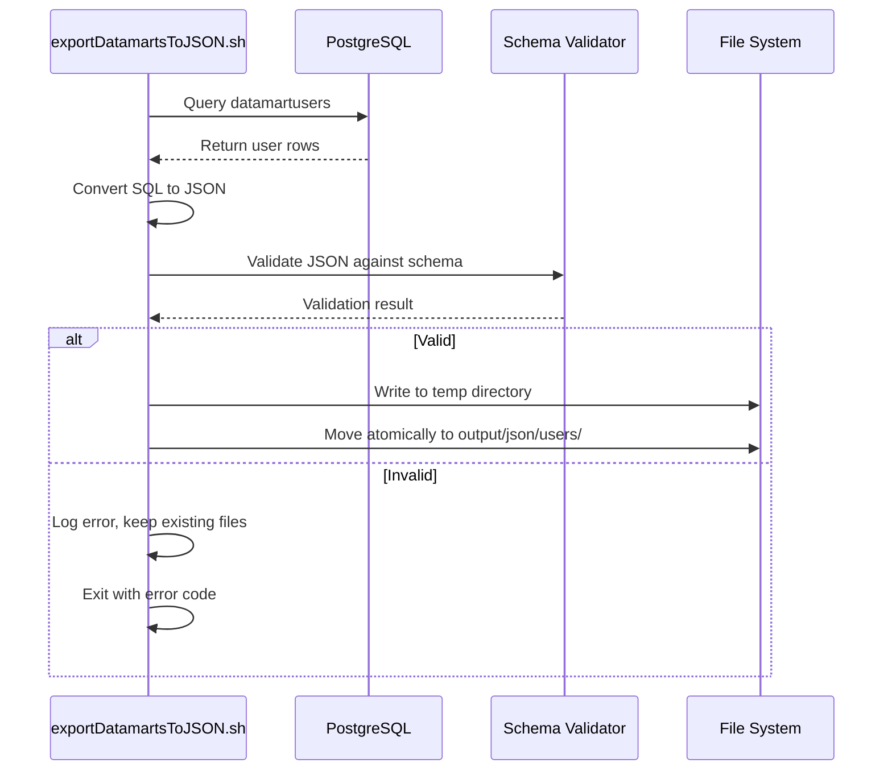
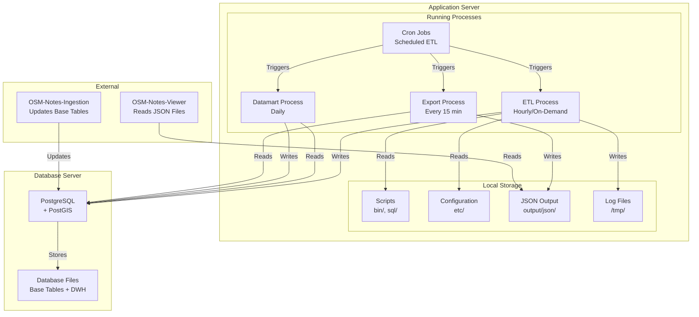
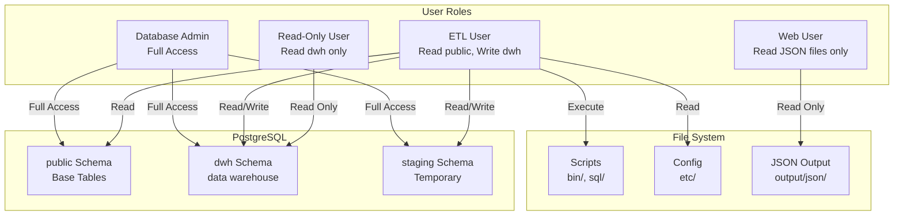
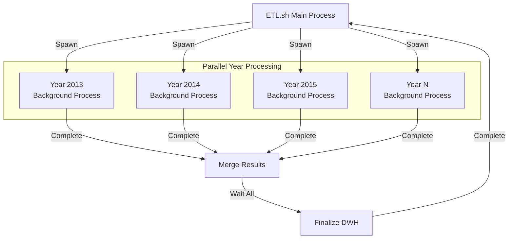

# Architecture Diagram

This document provides architecture diagrams for the OSM-Notes-Analytics system, following the C4 model for software architecture documentation. These diagrams help understand the system structure, components, and their interactions.

## Overview

The architecture documentation uses the C4 model:
- **Level 1 (System Context)**: System and its relationships with external entities
- **Level 2 (Container)**: High-level technical building blocks
- **Level 3 (Component)**: Components within containers (detailed in other docs)

## C4 Level 1: System Context Diagram

Shows the OSM-Notes-Analytics system and its relationships with users and external systems.



**System Relationships:**
- **OSM-Notes-Ingestion**: Upstream system providing base data
- **OSM-Notes-Viewer**: Downstream system consuming JSON exports
- **OSM-Notes-Common**: Shared library used by all three systems

**User Types:**
- **Data Engineers**: Run ETL processes, maintain data pipeline
- **Data Analysts**: Query data warehouse for analysis
- **Web Users**: Consume visualizations via web interface
- **Developers**: Maintain and enhance the system

---

## C4 Level 2: Container Diagram

Shows the high-level technical building blocks (containers) within the OSM-Notes-Analytics system.



**Containers:**

1. **Bash Scripts Layer**
   - Entry points for system operations
   - Orchestrates ETL and datamart processes
   - Handles error recovery and logging

2. **SQL Layer**
   - Database schema definitions
   - Staging procedures for transformations
   - Datamart aggregation logic

3. **PostgreSQL Database**
   - **public schema**: Base tables from ingestion
   - **dwh schema**: Star schema data warehouse
   - **staging schema**: Temporary processing area

4. **Shared Libraries**
   - Common functions (logging, validation, error handling)
   - Shared via Git submodule

5. **Configuration**
   - Database connection settings
   - ETL performance and behavior settings

6. **Output Files**
   - JSON exports for web viewer
   - Validated and schema-checked

---

## Detailed Architecture Diagram

Shows components, data flows, and technologies in detail.



---

## Technology Stack

### Core Technologies

| Layer | Technology | Version | Purpose |
|-------|------------|---------|---------|
| **Database** | PostgreSQL | 12+ | Data storage and processing |
| **Spatial** | PostGIS | 3.0+ | Geographic data support |
| **Scripting** | Bash | 4.0+ | ETL orchestration and automation |
| **SQL** | PostgreSQL SQL | 12+ | Data transformations and queries |

### Supporting Technologies

| Component | Technology | Purpose |
|-----------|------------|---------|
| **Logging** | bash_logger.sh | Structured logging (log4j-style) |
| **Validation** | JSON Schema | Export validation |
| **Testing** | BATS | Bash script testing |
| **CI/CD** | GitHub Actions | Automated testing and validation |
| **Code Quality** | shellcheck, shfmt | Code linting and formatting |
| **Parallel Processing** | GNU Parallel | Year-based parallel ETL |

### Shared Libraries

| Library | Location | Purpose |
|---------|----------|---------|
| **bash_logger.sh** | lib/osm-common/ | Logging framework |
| **commonFunctions.sh** | lib/osm-common/ | Common utilities |
| **validationFunctions.sh** | lib/osm-common/ | Data validation |
| **errorHandlingFunctions.sh** | lib/osm-common/ | Error handling |

---

## Component Interactions

### ETL Process Flow



### Datamart Process Flow



### Export Process Flow



---

## Data Architecture

### Schema Organization

```text
PostgreSQL Database: osm_notes
│
├── Schema: public (managed by OSM-Notes-Ingestion)
│   ├── notes
│   ├── note_comments
│   ├── note_comments_text
│   ├── users
│   └── countries
│
├── Schema: dwh (managed by OSM-Notes-Analytics)
│   ├── facts (partitioned by year)
│   │   ├── facts_2013
│   │   ├── facts_2014
│   │   ├── ...
│   │   └── facts_2025
│   ├── dimension_users
│   ├── dimension_countries
│   ├── dimension_days
│   ├── dimension_time_of_week
│   ├── dimension_applications
│   ├── dimension_application_versions
│   ├── dimension_hashtags
│   ├── dimension_timezones
│   ├── dimension_seasons
│   ├── dimension_automation_level
│   ├── dimension_experience_levels
│   ├── datamartusers
│   ├── datamartcountries
│   └── datamartglobal
│
└── Schema: staging (temporary, managed by ETL)
    ├── facts_2013 (per-year staging)
    ├── facts_2014
    └── ...
```

### Partitioning Strategy

- **Facts Table**: Partitioned by year using `action_at` column
- **Benefits**: 10-50x faster date-based queries
- **Maintenance**: Can VACUUM/ANALYZE individual partitions
- **Parallel Processing**: Process multiple years simultaneously

See [Partitioning Strategy](partitioning_strategy.md) for details.

---

## Deployment Architecture

### Single Server Deployment



### Deployment Components

1. **Application Server**
   - Bash scripts and SQL files
   - Cron jobs for scheduling
   - Configuration files
   - Output directory for JSON files

2. **Database Server**
   - PostgreSQL with PostGIS
   - Base tables (public schema)
   - Data warehouse (dwh schema)
   - Staging area (staging schema)

3. **External Systems**
   - OSM-Notes-Ingestion: Updates base tables
   - OSM-Notes-Viewer: Consumes JSON exports

---

## Security Architecture

### Access Control



**Security Practices:**
- Database credentials stored in `etc/properties.sh` (not in Git)
- JSON exports are read-only for web users
- ETL user has minimal required permissions
- Configuration files excluded from version control

---

## Performance Architecture

### Parallel Processing



**Performance Features:**
- **Parallel Processing**: Multiple years processed simultaneously
- **Partitioning**: Fast date-based queries
- **Indexing**: Optimized foreign keys and common queries
- **Incremental Updates**: Only process new data
- **Resource Monitoring**: Prevents system overload

---

## Scalability Considerations

### Current Architecture Supports

- **Data Volume**: ~20M+ fact rows, ~500K users, ~200 countries
- **Processing**: Parallel processing by year (12-13 parallel jobs)
- **Query Performance**: Partitioned tables, optimized indexes
- **Export**: Incremental JSON export (only changed entities)

### Future Scalability Options

1. **Horizontal Scaling**: Separate ETL and query servers
2. **Database Replication**: Read replicas for analytics queries
3. **Caching**: Redis cache for frequently accessed datamarts
4. **Distributed Processing**: Split ETL across multiple servers

---

## Related Documentation

- **[Data Flow Diagrams](Data_Flow_Diagrams.md)**: Data flow through the system
- **[Data Lineage](Data_Lineage.md)**: Data transformations and lineage
- **[DWH Star Schema ERD](DWH_Star_Schema_ERD.md)**: Database schema design
- **[ETL Enhanced Features](ETL_Enhanced_Features.md)**: ETL capabilities
- **[Troubleshooting Guide](Troubleshooting_Guide.md)**: Architecture-related issues

---

## References

- [C4 Model](https://c4model.com/) - Software architecture documentation
- [PostgreSQL Architecture](https://www.postgresql.org/docs/current/architecture.html)
- [Star Schema Design](https://www.kimballgroup.com/data-warehouse-business-intelligence-resources/kimball-techniques/dimensional-modeling-techniques/star-schema/)

