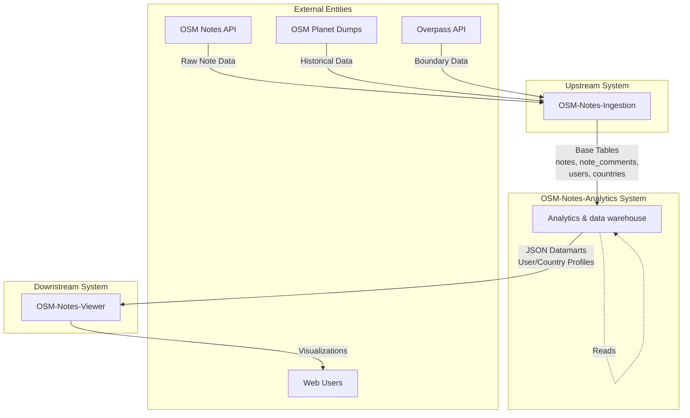
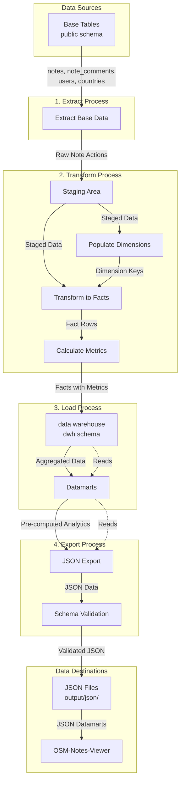
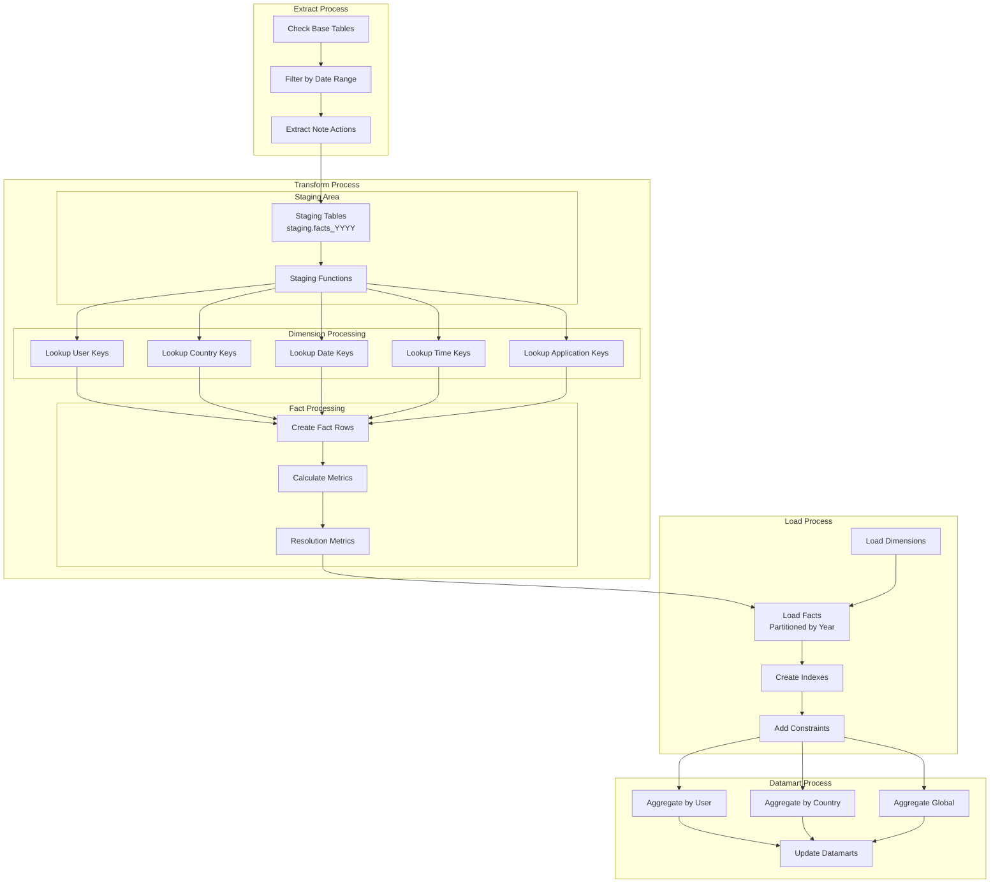

# Data Flow Diagrams (DFD)

This document provides Data Flow Diagrams (DFD) for the OSM-Notes-Analytics system, following
industry-standard DFD notation. These diagrams illustrate how data flows through the system from
sources to destinations.

## Overview

Data Flow Diagrams are used to visualize:

- **Data Sources**: Where data originates
- **Data Processes**: How data is transformed
- **Data Stores**: Where data is persisted
- **Data Flows**: How data moves between components

## DFD Level 0: Context Diagram

The context diagram shows the system as a single process and its interactions with external
entities.

**External Entities:**

- **OSM Notes API**: Real-time note data from OpenStreetMap
- **OSM Planet Dumps**: Historical note data archives
- **Overpass API**: Geographic boundary data
- **Web Users**: End users consuming visualizations

**Data Flows:**

- **Raw Note Data**: XML/JSON from OSM API
- **Historical Data**: XML dumps from Planet
- **Boundary Data**: Geographic boundaries from Overpass
- **Base Tables**: Structured data in PostgreSQL (managed by Ingestion)
- **JSON Datamarts**: Pre-computed analytics in JSON format
- **Visualizations**: Web interface for users

## DFD Level 1: System Decomposition

Level 1 breaks down the system into major processes: Extract, Transform, Load, and Export.

**Processes:**

1. **Extract Process**
   - Reads from base tables (`public.notes`, `public.note_comments`, etc.)
   - Filters by date range (for incremental updates)
   - Extracts note actions (open, comment, close, reopen)

2. **Transform Process**
   - **Staging**: Temporary storage for data transformation
   - **Populate Dimensions**: Resolve dimension keys (users, countries, dates, etc.)
   - **Transform to Facts**: Create fact table rows with dimension keys
   - **Calculate Metrics**: Compute derived metrics (days to resolution, etc.)

3. **Load Process**
   - **data warehouse**: Load facts and dimensions into star schema
   - **Datamarts**: Aggregate data into pre-computed analytics tables

4. **Export Process**
   - **JSON Export**: Convert datamarts to JSON format
   - **Schema Validation**: Validate JSON against schemas
   - **File Output**: Write validated JSON files

## DFD Level 2: ETL Process Detail

This diagram shows the detailed ETL process flow.

## Data Stores

### Base Tables (public schema)

- **notes**: Note records
- **note_comments**: Comment records
- **note_comments_text**: Comment text content
- **users**: User information
- **countries**: Country boundaries

### Staging Area (staging schema)

- **staging.facts_YYYY**: Year-specific staging tables (2013-2025+)
- Temporary storage for parallel processing

### data warehouse (dwh schema)

- **dwh.facts**: Central fact table (partitioned by year)
- **dwh.dimension\_\***: Dimension tables (users, countries, days, etc.)
- **dwh.datamartusers**: User analytics (78+ metrics)
- **dwh.datamartcountries**: Country analytics (77+ metrics)
- **dwh.datamartglobal**: Global statistics

### Export Files

- **output/json/users/**: User profile JSON files
- **output/json/countries/**: Country profile JSON files
- **output/json/indexes/**: Index files
- **output/json/metadata.json**: Metadata file

## Data Flow Descriptions

### Flow 1: Base Data → Extract

- **Source**: `public.notes`, `public.note_comments`
- **Content**: Raw note actions with timestamps, user IDs, note IDs
- **Volume**: Millions of rows (depends on ingestion)
- **Frequency**: Incremental (every 15 minutes) or full (initial load)

### Flow 2: Extract → Staging

- **Content**: Filtered note actions by date range
- **Transformation**: Basic filtering and date range selection
- **Storage**: Temporary staging tables per year

### Flow 3: Staging → Dimensions

- **Content**: Dimension lookups and key resolution
- **Transformation**: Resolve user IDs, country IDs, date IDs, etc.
- **Output**: Dimension keys for fact table

### Flow 4: Dimensions → Facts

- **Content**: Fact rows with dimension keys
- **Transformation**: Combine note actions with dimension keys
- **Metrics**: Calculate days to resolution, etc.

### Flow 5: Facts → data warehouse

- **Content**: Fact rows with all metrics
- **Storage**: Partitioned fact table (`dwh.facts`)
- **Partitioning**: By year (2013-2025+)

### Flow 6: data warehouse → Datamarts

- **Content**: Aggregated metrics
- **Transformation**: Group by user, country, or global
- **Output**: Pre-computed analytics (77+ metrics per country, 78+ metrics per user)

### Flow 7: Datamarts → JSON Export

- **Content**: Datamart rows converted to JSON
- **Transformation**: SQL to JSON conversion
- **Validation**: Schema validation before export

### Flow 8: JSON Export → Files

- **Content**: Validated JSON files
- **Storage**: File system (`output/json/`)
- **Format**: Individual files per user/country + index files

### Flow 9: JSON Files → Viewer

- **Content**: JSON datamarts
- **Consumption**: OSM-Notes-Viewer web application
- **Usage**: Web visualizations and dashboards

## Process Descriptions

### Process 1: Extract Base Data

- **Purpose**: Read note data from base tables
- **Input**: Base tables (public schema)
- **Output**: Filtered note actions
- **Frequency**: Incremental (hourly) or full (initial)
- **Script**: `bin/dwh/ETL.sh`

### Process 2: Transform to Staging

- **Purpose**: Prepare data for transformation
- **Input**: Raw note actions
- **Output**: Staged data in staging tables
- **Parallelization**: By year (2013-2025+)
- **Scripts**: `sql/dwh/Staging_*.sql`

### Process 3: Populate Dimensions

- **Purpose**: Resolve dimension keys
- **Input**: Staged data
- **Output**: Dimension tables populated
- **Dimensions**: Users, countries, dates, times, applications, etc.
- **Scripts**: `sql/dwh/ETL_25_populateDimensionTables.sql`, `ETL_26_updateDimensionTables.sql`

### Process 4: Transform to Facts

- **Purpose**: Create fact table rows
- **Input**: Staged data + dimension keys
- **Output**: Fact rows with metrics
- **Metrics**: Days to resolution, resolution rates, etc.
- **Scripts**: `sql/dwh/Staging_35_initialFactsLoadExecute.sql`

### Process 5: Load to data warehouse

- **Purpose**: Load facts into partitioned table
- **Input**: Fact rows
- **Output**: `dwh.facts` table (partitioned)
- **Partitioning**: By year for performance
- **Scripts**: `sql/dwh/Staging_51_unify.sql`, `ETL_41_addConstraintsIndexesTriggers.sql`

### Process 6: Generate Datamarts

- **Purpose**: Pre-compute aggregations
- **Input**: data warehouse (facts + dimensions)
- **Output**: Datamart tables
- **Metrics**: 77+ metrics per country, 78+ metrics per user
- **Scripts**: `bin/dwh/datamartUsers/datamartUsers.sh`,
  `bin/dwh/datamartCountries/datamartCountries.sh`

### Process 7: Export to JSON

- **Purpose**: Convert datamarts to JSON
- **Input**: Datamart tables
- **Output**: JSON files
- **Validation**: Schema validation before export
- **Script**: `bin/dwh/exportDatamartsToJSON.sh`

## Data Dictionary (DFD Context)

### External Entities

| Entity           | Description         | Data Provided          |
| ---------------- | ------------------- | ---------------------- |
| OSM Notes API    | OpenStreetMap API   | Real-time note data    |
| OSM Planet Dumps | Historical archives | Historical note data   |
| Overpass API     | Geographic data API | Country boundaries     |
| Web Users        | End users           | Visualization requests |

### Data Stores

| Store          | Schema     | Description              | Volume                                 |
| -------------- | ---------- | ------------------------ | -------------------------------------- |
| Base Tables    | public     | Raw note data            | ~20M+ rows                             |
| Staging Tables | staging    | Temporary transformation | Per-year partitions                    |
| Facts          | dwh        | Central fact table       | ~20M+ rows                             |
| Dimensions     | dwh        | Dimension tables         | Varies (users: ~500K, countries: ~200) |
| Datamarts      | dwh        | Pre-computed analytics   | Users: ~500K, Countries: ~200          |
| JSON Files     | filesystem | Exported datamarts       | ~500K+ files                           |

### Data Flows

| Flow            | From        | To         | Content                | Frequency                      |
| --------------- | ----------- | ---------- | ---------------------- | ------------------------------ |
| Base Data       | Base Tables | Extract    | Note actions           | Incremental (every 15 minutes) |
| Staged Data     | Extract     | Staging    | Filtered actions       | Per ETL run                    |
| Dimension Keys  | Staging     | Dimensions | Resolved keys          | Per ETL run                    |
| Fact Rows       | Staging     | Facts      | Fact rows with metrics | Per ETL run                    |
| Aggregated Data | Facts       | Datamarts  | Pre-computed metrics   | Per datamart run               |
| JSON Data       | Datamarts   | Export     | JSON format            | Per export run                 |
| Validated JSON  | Export      | Files      | Validated JSON         | Per export run                 |

## Incremental vs Full Load

### Full Load (Initial)

- Processes all data from 2013 to present
- Creates all partitions
- Populates all dimensions
- Loads all facts
- **Time**: ~1-1.5 hours for typical production dataset (~5-6M facts)
  - Initial load: ~25-30 minutes
  - Datamarts: 45-60 minutes (Countries: 30-40 min, Users: 15-20 min, Global: < 1 min)
- **Trigger**: `ETL.sh` (auto-detects first execution)
- **Longest stage**: Loading facts in parallel (12-15 minutes)
- **datamartCountries timing**: 1.5-3 minutes per country (depends on fact count per country)

### Incremental Load

- Processes only new data since last run
- Updates dimensions if needed
- Loads only new facts
- Updates affected datamarts
- **Time**: 5-15 minutes (normal) to 30-60 minutes (large updates)
- **Trigger**: `ETL.sh` (auto-detects incremental execution)
- **Note**: Large incrementals may require `PSQL_STATEMENT_TIMEOUT=2h` (see
  [Environment Variables](bin/dwh/ENVIRONMENT_VARIABLES.md))

## Parallel Processing

The ETL process uses parallel processing by year:

- Each year (2013-2025+) processed in parallel
- Staging tables created per year: `staging.facts_2013`, `staging.facts_2014`, etc.
- Results merged after all years complete
- **Configuration**: `ETL_MAX_PARALLEL_JOBS` in `etc/etl.properties`

## Error Handling and Recovery

- **Checkpoints**: Progress saved at key steps
- **Recovery**: Can resume from last checkpoint
- **Validation**: Data integrity checks at each stage
- **Logging**: Comprehensive logging for debugging
- **See**: [Troubleshooting Guide](Troubleshooting_Guide.md) for error handling details

## Related Documentation

- **[DWH Star Schema ERD](DWH_Star_Schema_ERD.md)**: Entity-relationship diagram
- **[Data Dictionary](DWH_Star_Schema_Data_Dictionary.md)**: Complete schema documentation
- **[ETL Enhanced Features](ETL_Enhanced_Features.md)**: ETL capabilities and configuration
- **[Data Lineage](Data_Lineage.md)**: Detailed data lineage documentation
- **[Troubleshooting Guide](Troubleshooting_Guide.md)**: Common issues and solutions

## References

- [Yourdon/DeMarco DFD Notation](https://en.wikipedia.org/wiki/Data_flow_diagram)
- [Gane-Sarson DFD Notation](https://en.wikipedia.org/wiki/Data_flow_diagram)
- [DAMA DMBOK - Data Flow Diagrams](https://www.dama.org/)
