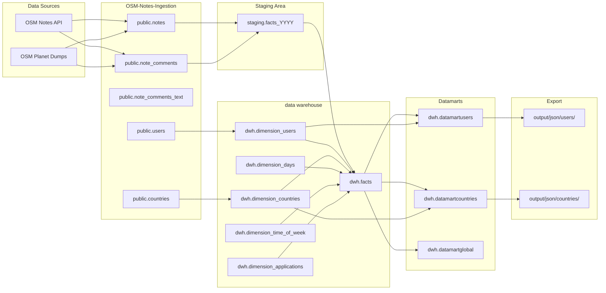

# Data Lineage Documentation

This document provides complete data lineage for the OSM-Notes-Analytics system, tracing data from source to destination with all transformations, dependencies, and business rules applied at each stage.

## Overview

Data lineage shows the complete path data takes through the system:
- **Source**: Where data originates
- **Transformations**: How data is changed at each stage
- **Destination**: Where data ends up
- **Dependencies**: What processes depend on what data

This documentation is essential for:
- Understanding data flow and transformations
- Debugging data quality issues
- Impact analysis (what breaks if source changes)
- Compliance and auditing
- Onboarding new team members

## Data Lineage Diagram

## Complete Lineage Paths

### Path 1: Note Actions → Facts Table

**Source**: `public.note_comments`  
**Destination**: `dwh.facts`  
**Process**: ETL Staging → Facts Load

#### Source Columns

| Source Column | Type | Description |
|---------------|------|-------------|
| `id_note` | INTEGER | OSM note identifier |
| `id_comment` | INTEGER | Comment identifier |
| `id_user` | INTEGER | User who created the comment |
| `action` | VARCHAR | Action type (opened, closed, commented, reopened, hidden) |
| `date_creation` | TIMESTAMP | When action occurred |
| `comment` | TEXT | Comment text (if applicable) |
| `id_application` | INTEGER | Application used |
| `application` | VARCHAR | Application name |

#### Transformations Applied

1. **Action Type Normalization**
   - Source: `action` (VARCHAR)
   - Target: `action_comment` (note_event_enum)
   - Rule: Map to enum values (opened, closed, commented, reopened, hidden)

2. **Timestamp Extraction**
   - Source: `date_creation` (TIMESTAMP)
   - Target: `action_at` (TIMESTAMP)
   - Rule: Direct copy

3. **User Dimension Resolution**
   - Source: `id_user` (INTEGER from public.users)
   - Target: `action_dimension_id_user` (INTEGER FK to dimension_users)
   - Rule: Lookup `dimension_user_id` from `dimension_users` where `user_id = id_user`
   - If not found: Insert new user into `dimension_users`, use new `dimension_user_id`

4. **Country Dimension Resolution**
   - Source: `public.notes.country_id` (via JOIN)
   - Target: `dimension_id_country` (INTEGER FK to dimension_countries)
   - Rule: Lookup `dimension_country_id` from `dimension_countries` where `country_id = notes.country_id`
   - If not found: Insert new country, use new `dimension_country_id`

5. **Date Dimension Resolution**
   - Source: `date_creation` (TIMESTAMP)
   - Target: `action_dimension_id_date` (INTEGER FK to dimension_days)
   - Rule: Lookup `dimension_day_id` from `dimension_days` where `date_id = DATE(date_creation)`
   - If not found: Insert new date into `dimension_days`, use new `dimension_day_id`

6. **Time-of-Week Dimension Resolution**
   - Source: `date_creation` (TIMESTAMP)
   - Target: `action_dimension_id_hour_of_week` (SMALLINT FK to dimension_time_of_week)
   - Rule: Calculate hour_of_week = (EXTRACT(DOW FROM date_creation) - 1) * 24 + EXTRACT(HOUR FROM date_creation)
   - Lookup `dimension_tow_id` from `dimension_time_of_week` where `hour_of_week = calculated_value`

7. **Application Dimension Resolution**
   - Source: `id_application`, `application` (from public.note_comments)
   - Target: `dimension_application_creation` (INTEGER FK to dimension_applications)
   - Rule: Lookup or insert application, resolve version if present

8. **Note Opening Context**
   - Source: `public.notes` (JOIN to get note creation info)
   - Target: `opened_dimension_id_date`, `opened_dimension_id_user`, `opened_dimension_id_hour_of_week`
   - Rule: For each fact, lookup the note's opening action and resolve dimension keys

9. **Note Closing Context**
   - Source: Previous closing actions (if any)
   - Target: `closed_dimension_id_date`, `closed_dimension_id_user`, `closed_dimension_id_hour_of_week`
   - Rule: For closing actions, set these fields. For other actions, lookup most recent close.

10. **Recent Open Date**
   - Source: All open/reopen actions for the note
   - Target: `recent_opened_dimension_id_date`
   - Rule: Most recent open or reopen date dimension key (calculated in unify step)

#### Calculated Metrics

11. **Days to Resolution**
   - Source: `opened_dimension_id_date`, `closed_dimension_id_date`
   - Target: `days_to_resolution` (INTEGER)
   - Rule: `closed_dimension_id_date - opened_dimension_id_date` (in days)
   - Applied: Only for closing actions, calculated by trigger

12. **Days to Resolution Active**
   - Source: All open periods for the note
   - Target: `days_to_resolution_active` (INTEGER)
   - Rule: Sum of all days note was open (handles reopens)
   - Applied: Calculated by trigger

13. **Days to Resolution from Reopen**
   - Source: Last reopen date, close date
   - Target: `days_to_resolution_from_reopen` (INTEGER)
   - Rule: `closed_dimension_id_date - recent_opened_dimension_id_date`
   - Applied: Calculated by trigger

14. **Comment Length**
   - Source: `public.note_comments_text.comment` (TEXT)
   - Target: `comment_length` (INTEGER)
   - Rule: `LENGTH(comment)` or 0 if NULL

15. **Has URL**
   - Source: `public.note_comments_text.comment` (TEXT)
   - Target: `has_url` (BOOLEAN)
   - Rule: `comment ~* 'https?://'` (regex match for URLs)

16. **Has Mention**
   - Source: `public.note_comments_text.comment` (TEXT)
   - Target: `has_mention` (BOOLEAN)
   - Rule: `comment ~* '@[a-zA-Z0-9_]+'` (regex match for mentions)

17. **Hashtag Count**
   - Source: `public.note_comments_text.comment` (TEXT)
   - Target: `hashtag_number` (INTEGER)
   - Rule: Count of `#` followed by alphanumeric characters

18. **Total Comments on Note**
   - Source: All previous comment actions for the note
   - Target: `total_comments_on_note` (INTEGER)
   - Rule: COUNT of comment actions before this action (calculated by trigger)

19. **Total Reopenings Count**
   - Source: All previous reopen actions for the note
   - Target: `total_reopenings_count` (INTEGER)
   - Rule: COUNT of reopen actions before this action (calculated by trigger)

20. **Total Actions on Note**
   - Source: All previous actions for the note
   - Target: `total_actions_on_note` (INTEGER)
   - Rule: COUNT of all actions before this action (calculated by trigger)

#### SQL Scripts

- **Staging**: `sql/dwh/Staging_31_createBaseStagingObjects.sql`
- **Staging Functions**: `sql/dwh/Staging_32_createStagingObjects.sql`
- **Fact Load**: `sql/dwh/Staging_35_initialFactsLoadExecute.sql`
- **Unify**: `sql/dwh/Staging_51_unify.sql`
- **Constraints/Triggers**: `sql/dwh/ETL_41_addConstraintsIndexesTriggers.sql`

---

### Path 2: Facts → User Datamart

**Source**: `dwh.facts` + `dwh.dimension_users`  
**Destination**: `dwh.datamartusers`  
**Process**: Datamart Users Aggregation

#### Source Data

- **Facts**: All facts where `action_dimension_id_user` is not NULL
- **Dimensions**: `dimension_users`, `dimension_countries`, `dimension_days`

#### Transformations Applied

1. **Grouping**
   - Group by: `action_dimension_id_user`
   - Result: One row per user

2. **Historical Counts - Whole History**
   - Source: All facts for user
   - Target: `history_whole_open`, `history_whole_commented`, `history_whole_closed`, etc.
   - Rule: `COUNT(*) WHERE action_comment = 'opened'` (and similar for other actions)

3. **Historical Counts - By Year**
   - Source: Facts filtered by year
   - Target: `history_2023_open`, `history_2024_open`, etc.
   - Rule: `COUNT(*) WHERE action_comment = 'opened' AND action_dimension_id_date IN (SELECT dimension_day_id FROM dimension_days WHERE year = 2023)`

4. **Historical Counts - Current Period**
   - Source: Facts filtered by current month/day
   - Target: `history_month_open`, `history_day_open`
   - Rule: Filter by current month/day using `dimension_days`

5. **Resolution Metrics**
   - Source: Facts with `days_to_resolution` not NULL
   - Target: `resolution_avg_days`, `resolution_median_days`, `resolution_rate`
   - Rule:
     - `AVG(days_to_resolution)` for resolution_avg_days
     - `PERCENTILE_CONT(0.5) WITHIN GROUP (ORDER BY days_to_resolution)` for median
     - `COUNT(*) WHERE action_comment = 'closed' / COUNT(*) WHERE action_comment = 'opened'` for rate

6. **Application Statistics**
   - Source: Facts with `dimension_application_creation` not NULL
   - Target: `applications_mobile_count`, `applications_desktop_count`, `application_most_used`
   - Rule:
     - Count mobile apps: `COUNT(DISTINCT dimension_application_creation) WHERE platform = 'mobile'`
     - Count desktop apps: `COUNT(DISTINCT dimension_application_creation) WHERE platform = 'desktop'`
     - Most used: `MODE() WITHIN GROUP (ORDER BY dimension_application_creation)`

7. **Content Quality Metrics**
   - Source: Facts with comment metrics
   - Target: `content_avg_comment_length`, `content_urls_count`, `content_mentions_count`
   - Rule:
     - `AVG(comment_length)`
     - `COUNT(*) WHERE has_url = TRUE`
     - `COUNT(*) WHERE has_mention = TRUE`

8. **Geographic Patterns**
   - Source: Facts grouped by country
   - Target: `countries_open_notes` (JSON array), `ranking_countries_opening_2013` (JSON)
   - Rule: `json_agg(DISTINCT dimension_id_country)` ordered by count

9. **Temporal Patterns**
   - Source: Facts with time dimensions
   - Target: `working_hours_of_week_opening` (JSON array), `last_year_activity` (string)
   - Rule:
     - Group by `action_dimension_id_hour_of_week`, count actions
     - Create GitHub-style activity heatmap (371 characters)

10. **First/Last Actions**
    - Source: Facts ordered by date
    - Target: `date_starting_creating_notes`, `first_open_note_id`, `lastest_open_note_id`
    - Rule: `MIN(action_dimension_id_date)`, `MIN(id_note)`, `MAX(id_note)`

#### SQL Scripts

- **Table Creation**: `sql/dwh/datamartUsers/datamartUsers_12_createDatamartUsersTable.sql`
- **Procedure**: `sql/dwh/datamartUsers/datamartUsers_13_createProcedure.sql`
- **Population**: `sql/dwh/datamartUsers/datamartUsers_32_populateDatamartUsersTable.sql`
- **Script**: `bin/dwh/datamartUsers/datamartUsers.sh`

---

### Path 3: Facts → Country Datamart

**Source**: `dwh.facts` + `dwh.dimension_countries`  
**Destination**: `dwh.datamartcountries`  
**Process**: Datamart Countries Aggregation

#### Transformations Applied

Similar to User Datamart but:
- **Grouping**: By `dimension_id_country` instead of `action_dimension_id_user`
- **Geographic Patterns**: Replaced with user patterns (`users_open_notes`, `users_solving_notes`)
- **Country Rankings**: Top countries by activity

#### SQL Scripts

- **Table Creation**: `sql/dwh/datamartCountries/datamartCountries_12_createDatamarCountriesTable.sql`
- **Procedure**: `sql/dwh/datamartCountries/datamartCountries_13_createProcedure.sql`
- **Population**: `sql/dwh/datamartCountries/datamartCountries_31_populateDatamartCountriesTable.sql`
- **Script**: `bin/dwh/datamartCountries/datamartCountries.sh`

---

### Path 4: Datamarts → JSON Export

**Source**: `dwh.datamartusers`, `dwh.datamartcountries`  
**Destination**: `output/json/users/{user_id}.json`, `output/json/countries/{country_id}.json`  
**Process**: JSON Export with Validation

#### Transformations Applied

1. **SQL to JSON Conversion**
   - Source: Datamart row (PostgreSQL row)
   - Target: JSON object
   - Rule: Convert all columns to JSON, handle NULLs, format dates

2. **Schema Validation**
   - Source: Generated JSON
   - Target: Validated JSON
   - Rule: Validate against JSON schema in `lib/osm-common/schemas/`
   - If invalid: Keep existing files, log error, exit

3. **Atomic Write**
   - Source: Validated JSON
   - Target: Final JSON file
   - Rule: Write to temp directory, validate, then move atomically

#### Column Mappings

**User Datamart → JSON:**
- All columns mapped directly
- JSON arrays preserved (countries, hashtags, rankings)
- Dates converted to ISO format
- NULLs handled appropriately

**Country Datamart → JSON:**
- All columns mapped directly
- JSON arrays preserved (users, hashtags, rankings)
- Dates converted to ISO format

#### Scripts

- **Export Script**: `bin/dwh/exportDatamartsToJSON.sh`
- **Schema Files**: `lib/osm-common/schemas/users.json`, `lib/osm-common/schemas/countries.json`

---

## Dimension Lineage

### User Dimension

**Source**: `public.users`  
**Destination**: `dwh.dimension_users`

#### Transformations

1. **User ID Mapping**
   - Source: `public.users.id_user`
   - Target: `dimension_users.user_id`
   - Rule: Direct copy

2. **Username (SCD2)**
   - Source: `public.users.username`
   - Target: `dimension_users.username`
   - Rule: Most recent username (SCD2: track changes over time)
   - If username changes: Create new dimension row with `valid_from`, `valid_to`

3. **Surrogate Key**
   - Source: Auto-generated
   - Target: `dimension_users.dimension_user_id`
   - Rule: SERIAL primary key

#### SQL Scripts

- **Table Creation**: `sql/dwh/ETL_22_createDWHTables.sql`
- **Population**: `sql/dwh/ETL_26_updateDimensionTables.sql`

---

### Country Dimension

**Source**: `public.countries`  
**Destination**: `dwh.dimension_countries`

#### Transformations

1. **Country ID Mapping**
   - Source: `public.countries.country_id`
   - Target: `dimension_countries.country_id`
   - Rule: Direct copy

2. **Country Names**
   - Source: `public.countries.country_name`, `country_name_es`, `country_name_en`
   - Target: `dimension_countries.country_name`, `country_name_es`, `country_name_en`
   - Rule: Direct copy

3. **ISO Codes** (Enrichment)
   - Source: Manual reference table
   - Target: `dimension_countries.iso_alpha2`, `iso_alpha3`
   - Rule: Lookup from `dwh.iso_country_codes` table
   - Script: `sql/dwh/ETL_24a_populateISOCodes.sql`

4. **Region Assignment**
   - Source: Geographic classification
   - Target: `dimension_countries.region_id` (FK to dimension_regions)
   - Rule: Lookup region based on country
   - Script: `sql/dwh/ETL_23_getWorldRegion.sql`

#### SQL Scripts

- **Table Creation**: `sql/dwh/ETL_22_createDWHTables.sql`
- **Region Assignment**: `sql/dwh/ETL_23_getWorldRegion.sql`
- **ISO Codes**: `sql/dwh/ETL_24a_populateISOCodes.sql`
- **Population**: `sql/dwh/ETL_25_populateDimensionTables.sql`

---

### Date Dimension

**Source**: Generated (not from base tables)  
**Destination**: `dwh.dimension_days`

#### Transformations

1. **Date Generation**
   - Source: Date range (2013-2030)
   - Target: `dimension_days.date_id` (DATE)
   - Rule: Generate all dates in range

2. **Date Attributes**
   - Source: `date_id`
   - Target: `year`, `month`, `day`, `day_of_week`, `quarter`, `iso_week`, etc.
   - Rule: Extract from date using PostgreSQL date functions

#### SQL Scripts

- **Table Creation**: `sql/dwh/ETL_22_createDWHTables.sql`
- **Population**: `sql/dwh/ETL_25_populateDimensionTables.sql`

---

## Business Rules Applied

### Rule 1: One Fact Per Action
- **Source**: `public.note_comments` (one row per comment/action)
- **Target**: `dwh.facts` (one row per action)
- **Rule**: Each note action becomes exactly one fact row
- **Exception**: None

### Rule 2: Dimension Key Resolution
- **Rule**: All foreign keys must resolve to existing dimension rows
- **Action if not found**: Insert new dimension row, then use new key
- **Applied to**: Users, countries, dates, times, applications

### Rule 3: Resolution Metrics Calculation
- **Rule**: Resolution metrics only calculated for closing actions
- **Trigger**: `calculate_resolution_metrics()` trigger on INSERT
- **Applied**: Automatically when closing action inserted

### Rule 4: Recent Open Date
- **Rule**: `recent_opened_dimension_id_date` must be NOT NULL
- **Enforcement**: After unify step (Staging_51_unify.sql)
- **Calculation**: Most recent open or reopen date for the note

### Rule 5: Datamart Incremental Updates
- **Rule**: Only update datamarts for modified entities
- **Flag**: `modified` column in dimension tables
- **Applied**: Datamart scripts check `modified = TRUE` before processing

### Rule 6: JSON Schema Validation
- **Rule**: All JSON exports must validate against schema
- **Action if invalid**: Keep existing files, log error, exit with error code
- **Applied**: Before atomic file move

---

## Dependencies

### Process Dependencies

1. **ETL depends on:**
   - Base tables populated by OSM-Notes-Ingestion
   - PostgreSQL database with PostGIS extension
   - Configuration files (`etc/properties.sh`, `etc/etl.properties`)

2. **Datamarts depend on:**
   - Data warehouse populated (facts + dimensions)
   - ETL completed successfully

3. **JSON Export depends on:**
   - Datamarts populated
   - Schema files present (`lib/osm-common/schemas/`)
   - Output directory writable

### Data Dependencies

1. **Facts depend on:**
   - `public.note_comments` (source data)
   - `public.notes` (for note context)
   - All dimension tables (for foreign keys)

2. **User Datamart depends on:**
   - `dwh.facts` (for aggregations)
   - `dwh.dimension_users` (for user info)
   - `dwh.dimension_countries` (for geographic patterns)

3. **Country Datamart depends on:**
   - `dwh.facts` (for aggregations)
   - `dwh.dimension_countries` (for country info)
   - `dwh.dimension_users` (for user patterns)

---

## Impact Analysis

### If Base Tables Change

**Impact on Facts:**
- Column changes in `public.note_comments` may break ETL
- New columns require ETL script updates
- Data type changes require transformation updates

**Mitigation:**
- ETL scripts validate table structure before processing
- Error handling logs missing columns
- See [Troubleshooting Guide](Troubleshooting_Guide.md)

### If Dimension Tables Change

**Impact on Facts:**
- Foreign key violations if dimension rows deleted
- New dimensions require fact table schema changes

**Mitigation:**
- Foreign key constraints prevent orphaned facts
- Dimension updates are additive (new rows, not deletions)

### If Fact Table Schema Changes

**Impact on Datamarts:**
- New fact columns may enable new metrics
- Datamart scripts may need updates

**Mitigation:**
- Datamart scripts use SELECT * or explicit column lists
- New columns don't break existing aggregations

### If Datamart Schema Changes

**Impact on JSON Export:**
- Schema validation will fail if JSON schema not updated
- Export script will keep existing files

**Mitigation:**
- Schema files versioned with datamart changes
- Validation prevents invalid exports

---

## Data Quality Checks

### Source Data Quality

1. **Missing User IDs**
   - Check: `public.note_comments.id_user IS NULL`
   - Action: Facts created with `action_dimension_id_user = NULL` (allowed)

2. **Invalid Action Types**
   - Check: `action NOT IN ('opened', 'closed', 'commented', 'reopened', 'hidden')`
   - Action: ETL logs warning, may skip row

3. **Missing Timestamps**
   - Check: `date_creation IS NULL`
   - Action: ETL fails (NOT NULL constraint)

### Transformation Quality

1. **Dimension Key Resolution Failures**
   - Check: Foreign key violations
   - Action: ETL inserts missing dimensions automatically

2. **Metric Calculation Errors**
   - Check: NULL metrics where expected
   - Action: Triggers handle NULL cases, log warnings

### Destination Quality

1. **Datamart Row Counts**
   - Check: `COUNT(*) FROM datamartusers` matches expected user count
   - Action: Validation queries in datamart scripts

2. **JSON Schema Validation**
   - Check: All JSON files validate against schema
   - Action: Export script validates before writing

---

## Lineage Metadata

### Source Metadata

| Source | Last Updated | Update Frequency | Volume |
|--------|--------------|------------------|--------|
| OSM Notes API | Real-time | Every 15 minutes | ~10K notes/day |
| OSM Planet | Daily | Daily | Full history |
| public.notes | Incremental | Hourly | ~20M+ rows |
| public.note_comments | Incremental | Hourly | ~50M+ rows |

### Transformation Metadata

| Process | Execution Time | Frequency | Dependencies |
|---------|----------------|----------|--------------|
| ETL (Full) | ~30 hours | Initial load | Base tables |
| ETL (Incremental) | 5-15 minutes | Hourly | Base tables |
| User Datamart | ~20 minutes | Daily | Facts + Dimensions |
| Country Datamart | ~5 minutes | Daily | Facts + Dimensions |
| JSON Export | ~10 minutes | Every 15 minutes | Datamarts |

### Destination Metadata

| Destination | Update Frequency | Format | Size |
|-------------|-------------------|--------|------|
| dwh.facts | Hourly (incremental) | PostgreSQL table | ~20M+ rows |
| dwh.datamartusers | Daily | PostgreSQL table | ~500K rows |
| dwh.datamartcountries | Daily | PostgreSQL table | ~200 rows |
| output/json/users/ | Every 15 minutes | JSON files | ~500K files |
| output/json/countries/ | Every 15 minutes | JSON files | ~200 files |

---

## Related Documentation

- **[Data Flow Diagrams](Data_Flow_Diagrams.md)**: Visual data flow diagrams
- **[DWH Star Schema ERD](DWH_Star_Schema_ERD.md)**: Entity-relationship diagram
- **[Data Dictionary](DWH_Star_Schema_Data_Dictionary.md)**: Complete column definitions
- **[ETL Enhanced Features](ETL_Enhanced_Features.md)**: ETL capabilities
- **[Troubleshooting Guide](Troubleshooting_Guide.md)**: Data quality issues

---

## References

- [DAMA DMBOK - Data Lineage](https://www.dama.org/)
- [Data Lineage Best Practices](https://www.collibra.com/us/en/blog/data-lineage)
- [Kimball Group - ETL Documentation](https://www.kimballgroup.com/)

