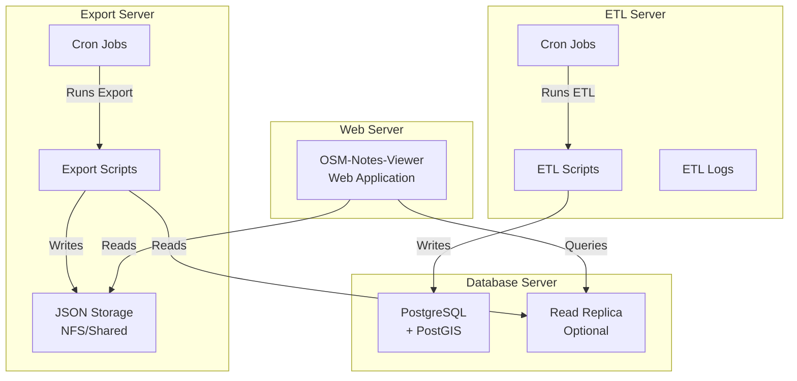
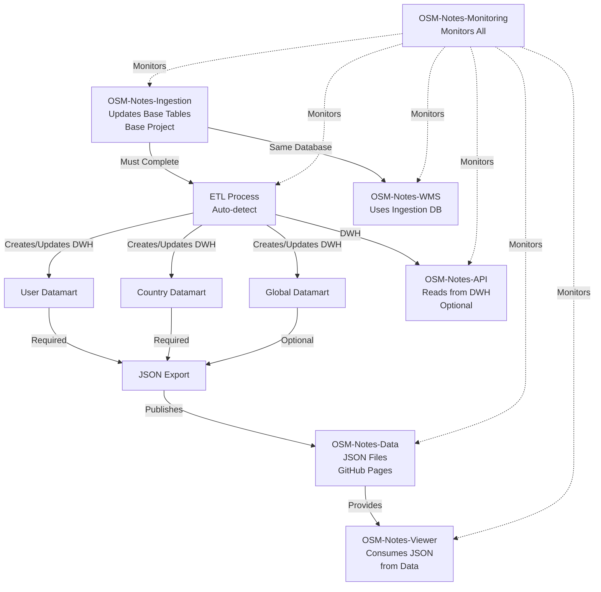
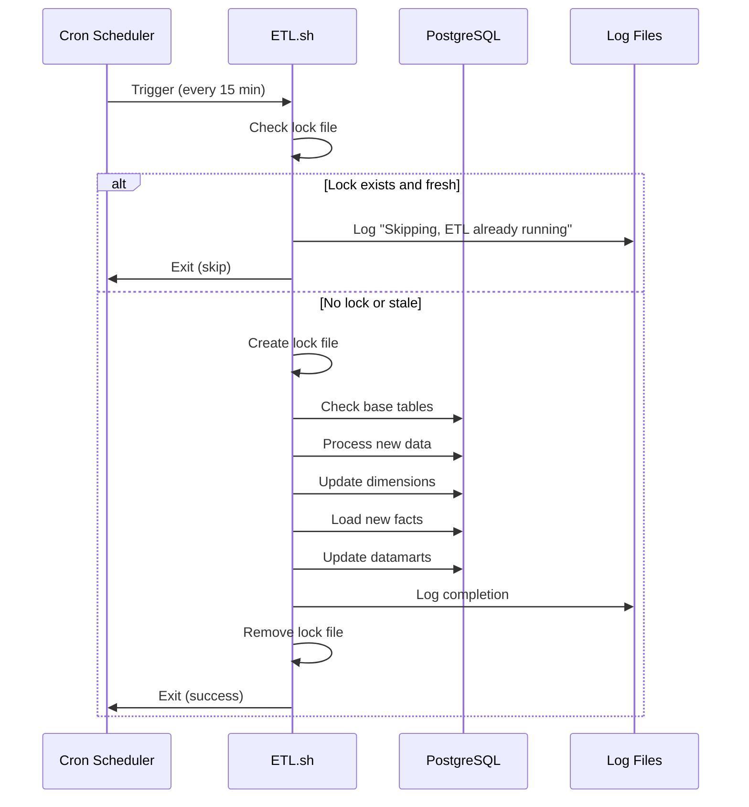
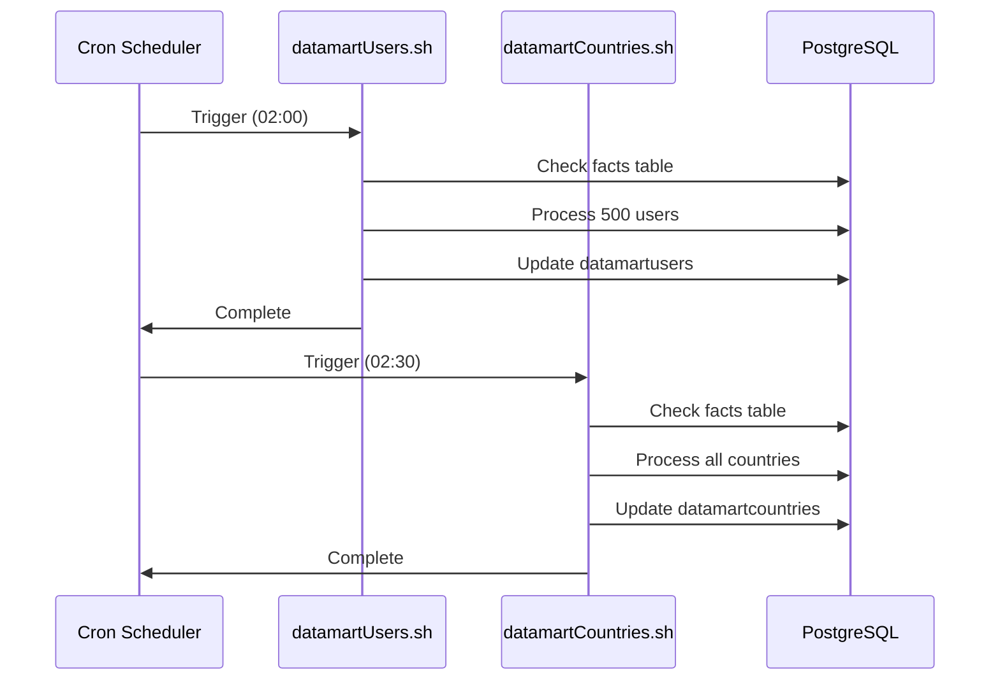
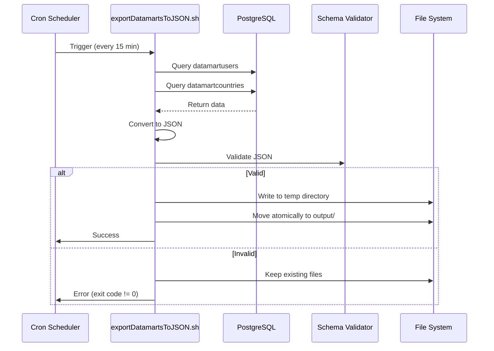

# Deployment Diagram

This document provides deployment architecture and operational diagrams for the OSM-Notes-Analytics
system, including infrastructure, scheduling, dependencies, and operational workflows.

## Table of Contents

- [Overview](#overview)
- [Deployment Architecture](#deployment-architecture)
  - [Single Server Deployment (Typical)](#single-server-deployment-typical)
  - [Multi-Server Deployment (Scalable)](#multi-server-deployment-scalable)
- [Operational Schedule](#operational-schedule)
  - [Production Schedule (Recommended)](#production-schedule-recommended)
  - [Cron Configuration](#cron-configuration)
- [Process Dependencies](#process-dependencies)
  - [Dependency Graph](#dependency-graph)
  - [Execution Order](#execution-order)
- [Infrastructure Requirements](#infrastructure-requirements)
  - [Server Specifications](#server-specifications)
  - [Database Server](#database-server)
- [Deployment Steps](#deployment-steps)
- [Operational Workflows](#operational-workflows)
  - [Workflow 1: Regular Incremental Update](#workflow-1-regular-incremental-update)
  - [Workflow 2: Daily Datamart Update](#workflow-2-daily-datamart-update)
  - [Workflow 3: JSON Export](#workflow-3-json-export)
- [Monitoring and Alerting](#monitoring-and-alerting)
  - [Health Checks](#health-checks)
  - [Monitoring Dashboard](#monitoring-dashboard)
- [Backup and Recovery](#backup-and-recovery)
  - [Backup Strategy](#backup-strategy)
  - [Recovery Procedures](#recovery-procedures)
- [Security Considerations](#security-considerations)
  - [Access Control](#access-control)
  - [Network Security](#network-security)
- [Performance Tuning](#performance-tuning)
  - [Database Tuning](#database-tuning)
  - [ETL Tuning](#etl-tuning)
- [Disaster Recovery](#disaster-recovery)
  - [Recovery Time Objectives (RTO)](#recovery-time-objectives-rto)
  - [Recovery Point Objectives (RPO)](#recovery-point-objectives-rpo)
- [Related Documentation](#related-documentation)
- [References](#references)

---

## Overview

The deployment diagram shows:

- **Infrastructure**: Servers, databases, and storage
- **Scheduling**: Automated processes and cron jobs
- **Dependencies**: Operational dependencies between processes
- **Workflows**: How processes interact in production

## Deployment Architecture

### Single Server Deployment (Typical)

```mermaid
graph TB
    subgraph Server["Application Server"]
        subgraph File_System["File System"]
            REPO[Repository<br/>OSM-Notes-Analytics/]
            SCRIPTS[Scripts<br/>bin/, sql/]
            CONFIG[Configuration<br/>etc/properties.sh<br/>etc/etl.properties]
            OUTPUT[JSON Output<br/>output/json/]
            LOGS[Log Files<br/>/tmp/ETL_*/]
        end

        subgraph Processes["Running Processes"]
            CRON_SERVICE[Cron Service<br/>Scheduled Jobs]
            ETL_PROC[ETL Process<br/>Running/Idle]
            DATAMART_PROC[Datamart Process<br/>Running/Idle]
            EXPORT_PROC[Export Process<br/>Running/Idle]
        end

        subgraph Scheduler["Scheduler (Cron)"]
            CRON_ETL[ETL Job<br/>Every 15 min]
            CRON_DATAMART[Datamart Job<br/>Daily 2 AM]
            CRON_EXPORT[Export Job<br/>Every 15 min]
            CRON_CLEANUP[Cleanup Job<br/>Weekly]
        end
    end

    subgraph Database_Server["Database Server"]
        POSTGRES[PostgreSQL<br/>+ PostGIS]
        BASE_SCHEMA[public Schema<br/>Base Tables]
        DWH_SCHEMA[dwh Schema<br/>data warehouse]
    end

    subgraph External["External Systems (OSM Notes Ecosystem)"]
        INGESTION[OSM-Notes-Ingestion<br/>Updates Base Tables<br/>Base Project]
        DATA[OSM-Notes-Data<br/>JSON Files<br/>GitHub Pages]
        VIEWER[OSM-Notes-Viewer<br/>Reads JSON Files<br/>from Data]
        API[OSM-Notes-API<br/>Reads from DWH<br/>Optional Consumer]
        WMS[OSM-Notes-WMS<br/>Uses Ingestion DB]
        MONITORING[OSM-Notes-Monitoring<br/>Monitors All]
    end

    CRON_SERVICE -->|Triggers| CRON_ETL
    CRON_SERVICE -->|Triggers| CRON_DATAMART
    CRON_SERVICE -->|Triggers| CRON_EXPORT
    CRON_SERVICE -->|Triggers| CRON_CLEANUP

    CRON_ETL -->|Executes| ETL_PROC
    CRON_DATAMART -->|Executes| DATAMART_PROC
    CRON_EXPORT -->|Executes| EXPORT_PROC

    ETL_PROC -->|Reads| SCRIPTS
    ETL_PROC -->|Reads| CONFIG
    ETL_PROC -->|Writes| POSTGRES
    ETL_PROC -->|Writes| LOGS

    DATAMART_PROC -->|Reads| POSTGRES
    DATAMART_PROC -->|Writes| POSTGRES

    EXPORT_PROC -->|Reads| POSTGRES
    EXPORT_PROC -->|Writes| OUTPUT

    INGESTION -->|Updates| BASE_SCHEMA
    EXPORT_PROC -->|Publishes| DATA
    DATA -->|Serves JSON| VIEWER
    POSTGRES -->|Reads| API
    INGESTION -->|Same DB| WMS
    MONITORING -.->|Monitors| ANALYTICS_SYSTEM
    MONITORING -.->|Monitors| INGESTION
    MONITORING -.->|Monitors| API
    MONITORING -.->|Monitors| DATA
    MONITORING -.->|Monitors| VIEWER
    MONITORING -.->|Monitors| WMS

    POSTGRES -->|Stores| BASE_SCHEMA
    POSTGRES -->|Stores| DWH_SCHEMA
```



### Multi-Server Deployment (Scalable)



---

## Operational Schedule

### Production Schedule (Recommended)

```mermaid
gantt
    title Production ETL Schedule
    dateFormat HH:mm
    axisFormat %H:%M

    section Hourly
    ETL Incremental    :active, etl1, 00:00, 00:15
    ETL Incremental    :etl2, 00:15, 00:15
    ETL Incremental    :etl3, 00:30, 00:15
    ETL Incremental    :etl4, 00:45, 00:15

    section Daily
    Datamart Users     :crit, dm1, 02:00, 00:20
    Datamart Countries :crit, dm2, 02:20, 00:05
    Datamart Global    :dm3, 02:25, 00:05

    section Every 15 min
    JSON Export        :active, exp1, 00:00, 00:10
    JSON Export        :exp2, 00:15, 00:10
    JSON Export        :exp3, 00:30, 00:10
    JSON Export        :exp4, 00:45, 00:10

    section Weekly
    Log Cleanup        :cleanup, 03:30, 00:30
    VACUUM ANALYZE     :vacuum, 03:00, 01:00
```



### Cron Configuration

**Standard Production Schedule:**

```cron
# ETL: Incremental updates every 15 minutes
*/15 * * * * export CLEAN=false ; export LOG_LEVEL=INFO ; export DBNAME=notes ; export DB_USER=notes ; /home/notes/OSM-Notes-Analytics/bin/dwh/ETL.sh >> /var/log/osm-notes-etl.log 2>&1

# Datamarts: Update daily at 2 AM (after ETL completes)
0 2 * * * /home/notes/OSM-Notes-Analytics/bin/dwh/datamartUsers/datamartUsers.sh >> /var/log/osm-notes-datamarts.log 2>&1
30 2 * * * /home/notes/OSM-Notes-Analytics/bin/dwh/datamartCountries/datamartCountries.sh >> /var/log/osm-notes-datamarts.log 2>&1

# JSON Export: Every 15 minutes (after datamarts update)
*/15 * * * * /home/notes/OSM-Notes-Analytics/bin/dwh/exportDatamartsToJSON.sh >> /var/log/osm-notes-export.log 2>&1

# Maintenance: Weekly cleanup and optimization
0 3 * * 0 psql -U notes -d notes_dwh -c "VACUUM ANALYZE dwh.facts;" >> /var/log/osm-notes-maintenance.log 2>&1
30 3 * * 0 find /tmp/ETL_* -type d -mtime +7 -exec rm -rf {} \; 2>/dev/null || true
```

**Schedule Breakdown:**

| Process              | Frequency    | Time         | Duration | Purpose                  |
| -------------------- | ------------ | ------------ | -------- | ------------------------ |
| **ETL Incremental**  | Every 15 min | All day      | 5-15 min | Process new notes        |
| **User Datamart**    | Daily        | 02:00        | ~20 min  | Update user analytics    |
| **Country Datamart** | Daily        | 02:30        | ~5 min   | Update country analytics |
| **Global Datamart**  | Daily        | 02:35        | ~2 min   | Update global stats      |
| **JSON Export**      | Every 15 min | All day      | ~10 min  | Export for viewer        |
| **VACUUM ANALYZE**   | Weekly       | Sunday 03:00 | ~1 hour  | Database optimization    |
| **Log Cleanup**      | Weekly       | Sunday 03:30 | ~5 min   | Remove old logs          |

---

## Process Dependencies

### Dependency Graph



### Execution Order

**Initial Deployment:**

1. Deploy OSM-Notes-Ingestion (populate base tables) - Base project
2. Wait for base tables to have data
3. Deploy OSM-Notes-WMS (optional, uses same database as Ingestion)
4. Run ETL (auto-detects first execution, creates DWH)
5. Run datamart scripts (initial population)
6. Run JSON export (creates OSM-Notes-Data)
7. Deploy OSM-Notes-Viewer (consumes Data)
8. Deploy OSM-Notes-API (optional, reads from Analytics DWH)
9. Deploy OSM-Notes-Monitoring (monitors all components)

**Regular Operations:**

1. OSM-Notes-Ingestion runs (updates base tables)
2. ETL runs (every 15 minutes, auto-detects incremental)
3. Datamarts update (daily at 2 AM)
4. JSON export runs (every 15 minutes, updates OSM-Notes-Data)
5. OSM-Notes-Viewer reads JSON files from Data
6. OSM-Notes-API serves queries from Analytics DWH
7. OSM-Notes-Monitoring monitors all components

---

## Infrastructure Requirements

### Server Specifications

#### Minimum Requirements

| Component   | Specification | Purpose                 |
| ----------- | ------------- | ----------------------- |
| **CPU**     | 4 cores       | Parallel ETL processing |
| **RAM**     | 8 GB          | Database operations     |
| **Disk**    | 100 GB        | Database + logs         |
| **Network** | 100 Mbps      | Database connectivity   |

#### Recommended Production

| Component   | Specification | Purpose                    |
| ----------- | ------------- | -------------------------- |
| **CPU**     | 8+ cores      | Faster parallel processing |
| **RAM**     | 16+ GB        | Larger datasets            |
| **Disk**    | 500+ GB SSD   | Fast I/O for database      |
| **Network** | 1 Gbps        | Database connectivity      |

### Database Server

**PostgreSQL Configuration:**

- **Version**: 12 or higher
- **PostGIS**: 3.0 or higher
- **Shared Memory**: 4 GB minimum
- **Work Memory**: 256 MB per connection
- **Maintenance Work Memory**: 1 GB
- **Max Connections**: 100

**Storage:**

- **Base Tables**: ~50 GB (depends on ingestion)
- **data warehouse**: ~100 GB (facts + dimensions)
- **Datamarts**: ~5 GB
- **Indexes**: ~20 GB
- **Total Estimated**: ~175 GB

---

## Deployment Steps

### Step 1: Prerequisites

```bash
# Install PostgreSQL and PostGIS
sudo apt-get install postgresql-12 postgresql-12-postgis-3

# Install Bash 4.0+
bash --version  # Should be 4.0 or higher

# Install development tools (optional)
sudo apt-get install shellcheck shfmt bats
```

### Step 2: Clone Repository

```bash
# Clone with submodules
git clone --recurse-submodules https://github.com/OSM-Notes/OSM-Notes-Analytics.git
cd OSM-Notes-Analytics

# Or if already cloned, initialize submodules
git submodule update --init --recursive
```

### Step 3: Configure Database

```bash
# Create database (if not exists)
createdb notes_dwh

# Enable PostGIS
psql -d notes_dwh -c "CREATE EXTENSION postgis;"
psql -d notes_dwh -c "CREATE EXTENSION btree_gist;"

# Configure connection
cp etc/properties.sh.example etc/properties.sh
nano etc/properties.sh  # Edit with your credentials
```

### Step 4: Verify Base Tables

```bash
# Check base tables exist (from Ingestion)
psql -d osm_notes -c "SELECT COUNT(*) FROM notes;"
psql -d osm_notes -c "SELECT COUNT(*) FROM note_comments;"

# If empty, run OSM-Notes-Ingestion first
```

### Step 5: Initial ETL Load

```bash
# Run initial ETL (takes ~30 hours)
cd bin/dwh
./ETL.sh

# Monitor progress
tail -f /tmp/ETL_*/ETL.log
```

### Step 6: Setup Cron Jobs

```bash
# Copy cron template
cp etc/cron.example /tmp/osm-notes-cron

# Edit with your paths
nano /tmp/osm-notes-cron

# Install cron
crontab /tmp/osm-notes-cron

# Verify
crontab -l
```

See [Cron Setup Guide](Cron_Setup.md) for detailed cron configuration.

### Step 7: Verify Deployment

```bash
# Check ETL ran successfully
psql -d osm_notes -c "SELECT COUNT(*) FROM dwh.facts;"

# Check datamarts populated
psql -d osm_notes -c "SELECT COUNT(*) FROM dwh.datamartusers;"
psql -d osm_notes -c "SELECT COUNT(*) FROM dwh.datamartcountries;"

# Check JSON files created
ls -lh output/json/users/ | head -10
ls -lh output/json/countries/ | head -10
```

---

## Operational Workflows

### Workflow 1: Regular Incremental Update



### Workflow 2: Daily Datamart Update



### Workflow 3: JSON Export



---

## Monitoring and Alerting

### Health Checks

**Automated Health Check Script:**

```bash
#!/bin/bash
# bin/dwh/health_check.sh

# Check database connectivity
psql -d osm_notes -c "SELECT 1;" || echo "ERROR: Database connection failed"

# Check ETL ran recently (within last hour)
LAST_ETL=$(find /tmp/ETL_* -name "ETL.log" -mmin -60 | head -1)
if [ -z "$LAST_ETL" ]; then
  echo "WARNING: ETL hasn't run in last hour"
fi

# Check datamarts have data
USER_COUNT=$(psql -d osm_notes -t -c "SELECT COUNT(*) FROM dwh.datamartusers;")
if [ "$USER_COUNT" -eq 0 ]; then
  echo "ERROR: User datamart is empty"
fi

# Check disk space
DISK_USAGE=$(df -h / | awk 'NR==2 {print $5}' | sed 's/%//')
if [ "$DISK_USAGE" -gt 90 ]; then
  echo "WARNING: Disk usage at ${DISK_USAGE}%"
fi
```

### Monitoring Dashboard

**Key Metrics to Monitor:**

1. **ETL Execution**
   - Last execution time
   - Execution duration
   - Success/failure rate
   - Rows processed

2. **Database Health**
   - Connection status
   - Table sizes
   - Index usage
   - Query performance

3. **Datamart Status**
   - Last update time
   - Row counts
   - Data freshness

4. **Export Status**
   - Last export time
   - File counts
   - Validation status
   - File sizes

5. **System Resources**
   - CPU usage
   - Memory usage
   - Disk space
   - Disk I/O

---

## Backup and Recovery

### Backup Strategy

**Database Backups:**

```bash
# Daily full backup of DWH schema
0 1 * * * pg_dump -U postgres -d osm_notes -n dwh > /backups/dwh_$(date +\%Y\%m\%d).sql

# Weekly full database backup
0 2 * * 0 pg_dump -U postgres -d osm_notes > /backups/full_$(date +\%Y\%m\%d).sql

# Keep last 30 days
0 3 * * * find /backups/*.sql -mtime +30 -delete
```

**JSON Export Backups:**

```bash
# Daily backup of JSON exports
0 4 * * * tar -czf /backups/json_$(date +\%Y\%m\%d).tar.gz output/json/

# Keep last 7 days
0 5 * * * find /backups/json_*.tar.gz -mtime +7 -delete
```

### Recovery Procedures

**Scenario 1: ETL Failure**

```bash
# Check logs
tail -100 /tmp/ETL_*/ETL.log

# Check for lock file
ls -lh /tmp/ETL_*/ETL.lock

# Remove stale lock if needed
find /tmp/ETL_* -name "ETL.lock" -mmin +240 -delete

# Resume ETL
./bin/dwh/ETL.sh
```

**Scenario 2: Database Corruption**

```bash
# Restore from backup
psql -U notes -d notes_dwh < /backups/dwh_20250115.sql

# Re-run ETL if needed
./bin/dwh/ETL.sh
```

**Scenario 3: JSON Export Failure**

```bash
# Check validation errors
grep -i "validation" /var/log/osm-notes-export.log

# Re-export manually
./bin/dwh/exportDatamartsToJSON.sh
```

---

## Security Considerations

### Access Control

**Database Users:**

```sql
-- ETL User (read public, write dwh)
CREATE USER etl_user WITH PASSWORD 'secure_password';
GRANT USAGE ON SCHEMA public TO etl_user;
GRANT SELECT ON ALL TABLES IN SCHEMA public TO etl_user;
GRANT ALL ON SCHEMA dwh TO etl_user;
GRANT ALL ON ALL TABLES IN SCHEMA dwh TO etl_user;

-- Read-only user (for analysts)
CREATE USER analyst_user WITH PASSWORD 'secure_password';
GRANT USAGE ON SCHEMA dwh TO analyst_user;
GRANT SELECT ON ALL TABLES IN SCHEMA dwh TO analyst_user;
```

**File System Permissions:**

```bash
# Scripts: executable by owner, readable by group
chmod 750 bin/dwh/*.sh

# Configuration: readable by owner only
chmod 600 etc/properties.sh
chmod 600 etc/etl.properties

# Output: readable by web server, writable by ETL user
chmod 755 output/json/
chmod 644 output/json/**/*.json
```

### Network Security

- **Database**: Listen only on localhost or private network
- **Firewall**: Restrict database port (5432) to application servers only
- **SSL**: Use SSL for database connections in production
- **Backups**: Encrypt backup files

---

## Performance Tuning

### Database Tuning

**PostgreSQL Configuration (`postgresql.conf`):**

```ini
# Memory settings
shared_buffers = 4GB
work_mem = 256MB
maintenance_work_mem = 1GB

# Query planner
random_page_cost = 1.1  # For SSD
effective_cache_size = 12GB

# Parallel processing
max_parallel_workers_per_gather = 4
max_parallel_workers = 8
```

### ETL Tuning

**Configuration (`etc/etl.properties`):**

```bash
# Increase batch size for faster processing
ETL_BATCH_SIZE=5000

# Increase parallel jobs for multi-core systems
ETL_MAX_PARALLEL_JOBS=8

# Adjust memory threshold
MAX_MEMORY_USAGE=85
```

---

## Disaster Recovery

### Recovery Time Objectives (RTO)

| Component       | RTO        | Recovery Method                  |
| --------------- | ---------- | -------------------------------- |
| **ETL Process** | 1 hour     | Re-run ETL from last checkpoint  |
| **Datamarts**   | 2 hours    | Re-run datamart scripts          |
| **JSON Export** | 15 minutes | Re-run export script             |
| **Database**    | 4 hours    | Restore from backup + re-run ETL |

### Recovery Point Objectives (RPO)

| Component          | RPO      | Backup Frequency |
| ------------------ | -------- | ---------------- |
| **data warehouse** | 24 hours | Daily backups    |
| **JSON Exports**   | 24 hours | Daily backups    |
| **Configuration**  | 7 days   | Weekly backups   |

---

## Related Documentation

- **[Cron Setup Guide](Cron_Setup.md)**: Detailed cron configuration
- **[Architecture Diagram](Architecture_Diagram.md)**: System architecture
- **[Troubleshooting Guide](Troubleshooting_Guide.md)**: Operational issues
- **[DWH Maintenance Guide](DWH_Maintenance_Guide.md)**: Database maintenance

---

## References

- [PostgreSQL Administration](https://www.postgresql.org/docs/current/admin.html)
- [Cron Documentation](https://man7.org/linux/man-pages/man5/crontab.5.html)
- [Disaster Recovery Planning](https://www.postgresql.org/docs/current/backup.html)
