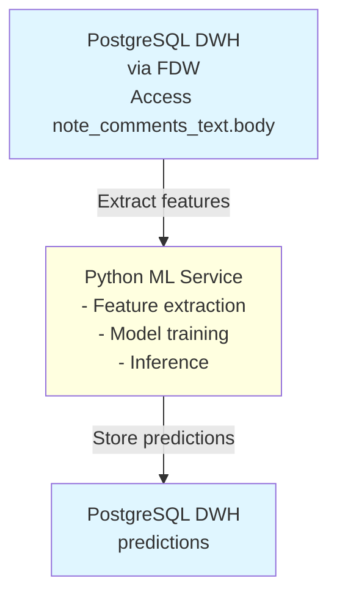

# Machine Learning Implementation Plan

**Status**: Future Enhancement  
**Priority**: 🟢 LOW  
**Estimated Effort**: 8-12 hours (initial implementation)  
**Dependencies**: All datamart metrics completed ✅

---

## 📋 Overview

This document outlines the plan for implementing Machine Learning (ML) capabilities in the OSM Notes
Analytics system. **The ML implementation builds upon and enhances existing manual and automated
analysis methods** that are already being used to classify and understand notes.

### Existing Analysis Context

**Current Analysis Methods** (documented in [Note_Categorization.md](Note_Categorization.md)):

1. **Manual Classification**: Comprehensive note type system based on years of experience (18+
   specific types)
2. **Metric-Based Analysis**: SQL queries using metrics like `comment_length`, `has_url`,
   `total_comments_on_note`, `days_to_resolution`
3. **Application Pattern Analysis**: Identifying note types based on source applications (Maps.me,
   StreetComplete, etc.)
4. **Hashtag Analysis**: Pattern recognition using hashtags (see
   `sql/dwh/ml/ml_00_analyzeHashtagsForClassification.sql`)
5. **Text Pattern Analysis**: Keyword searches and text pattern matching
6. **Historical Outcome Analysis**: Learning from past note resolutions (processed vs closed vs
   needs more data)
7. **User Behavior Analysis**: Patterns in user response times, collaboration, and note handling

**These existing analyses provide rich context and knowledge** that informs and enhances the ML
implementation.

### ML Enhancement Strategy

**ML doesn't replace existing analysis—it enhances it** by:

1. **Learning from Manual Classifications**: Using the comprehensive note type system as training
   labels
2. **Combining Multiple Signals**: Integrating metrics, text patterns, hashtags, and historical
   outcomes
3. **Context Understanding**: Going beyond keyword matching to understand semantic meaning
4. **Pattern Recognition**: Identifying subtle patterns that are difficult to express as rules
5. **Continuous Improvement**: Learning from new data and outcomes over time

The primary goal is to **classify notes** according to the comprehensive system described in
[Note_Categorization.md](Note_Categorization.md), which includes:

1. **Main Category**: Does the note contribute with a change or not?
2. **Specific Type**: One of 18+ detailed note types (adds_to_map, modifies_map, personal_data,
   etc.)
3. **Action Recommendation**: Should it be processed, closed, or needs more data?

**ML builds upon existing knowledge** to provide more accurate, context-aware classification.

---

## 📚 Building on Existing Analysis

### Current Analysis Capabilities

The OSM Notes Analytics system already provides extensive analysis capabilities that inform note
classification:

#### 1. Manual Classification System

**Source**: [Note_Categorization.md](Note_Categorization.md) based on
[AngocA's comprehensive note type analysis](https://www.openstreetmap.org/user/AngocA/diary/398472)

**Knowledge Captured**:

- 18+ specific note types with detailed characteristics
- Examples and patterns for each type
- Indicators and markers for classification
- Best practices for handling each type

**How ML Uses This**:

- **Training Labels**: Manual classifications provide high-quality labeled data
- **Feature Engineering**: Characteristics and indicators become ML features
- **Validation**: Manual classifications validate ML predictions
- **Domain Knowledge**: Expert knowledge guides model architecture

#### 2. Metric-Based Classification Queries

**Source**:
[Note_Categorization.md - Classification Queries](Note_Categorization.md#classification-queries)

**Existing Patterns**:

```sql
-- Notes needing more data: comment_length < 50 AND total_comments_on_note > 2
-- Notes likely processed: Maps.me/StreetComplete apps AND comment_length > 30
-- Notes likely closed: comment_length < 20 OR (comment_length > 200 AND has_url)
-- Obsolete notes: days_open > 180
```

**How ML Uses This**:

- **Feature Engineering**: These metrics become ML features (`comment_length`, `has_url`,
  `total_comments_on_note`, `days_to_resolution`)
- **Baseline Rules**: Existing SQL patterns inform initial feature importance
- **Validation**: Compare ML predictions with metric-based rules
- **Hybrid Approach**: Use rules for clear cases, ML for ambiguous

#### 3. Application Pattern Analysis

**Source**: [Note_Categorization.md](Note_Categorization.md) - Notes from assisted apps (Maps.me,
StreetComplete, OrganicMaps) are more likely actionable

**Existing Knowledge**:

- Application-to-note-type correlations
- Mobile vs desktop app patterns
- Application version impact on note quality

**How ML Uses This**:

- **Categorical Features**: `dimension_application_creation` as a feature
- **Pattern Learning**: ML learns application-specific patterns
- **Context Features**: Application type informs classification confidence

#### 4. Hashtag Pattern Analysis

**Source**: `sql/dwh/ml/ml_00_analyzeHashtagsForClassification.sql` and
[External_Classification_Strategies.md](External_Classification_Strategies.md)

**Existing Analysis**:

- Most common hashtags and their usage patterns
- Hashtag-to-outcome correlations (processed vs closed)
- Hashtag co-occurrence patterns
- Category indicators from hashtags

**How ML Uses This**:

- **Hashtag Features**: Presence of specific hashtags as boolean features
- **Hashtag Categories**: Pre-classified hashtag categories inform ML
- **Pattern Recognition**: ML learns which hashtag combinations indicate note types
- **High-Precision Signals**: Hashtags provide strong signals for certain types

#### 5. Text Pattern Analysis

**Source**: Manual text analysis, keyword searches, and
[External_Classification_Strategies.md](External_Classification_Strategies.md)

**Existing Patterns**:

- Keyword lists for different note types (firefighter, airplane, wheelchair, etc.)
- Text patterns indicating note types ("new", "missing", "wrong", "casa de", etc.)
- Semantic patterns (action phrases, question phrases, closing phrases)

**How ML Uses This**:

- **Keyword Features**: Presence of known keywords as features
- **Text Embeddings**: Full text analysis goes beyond keyword matching
- **Semantic Understanding**: ML understands context, not just keywords
- **Multi-language Support**: ML can learn patterns across languages

#### 6. Historical Outcome Analysis

**Source**: Analysis of resolved notes in `dwh.facts` - which notes were processed, closed, or
needed more data

**Existing Knowledge**:

- Patterns in notes that were successfully processed
- Characteristics of notes that were simply closed
- Indicators of notes that needed clarification

**How ML Uses This**:

- **Training Data**: Historical outcomes provide labels for supervised learning
- **Pattern Learning**: ML learns from thousands of historical examples
- **Outcome Prediction**: ML predicts likely outcomes based on historical patterns
- **Confidence Calibration**: Historical data helps calibrate prediction confidence

#### 7. User Behavior Analysis

**Source**: User metrics in `dwh.datamartUsers` and analysis patterns

**Existing Patterns**:

- User response time patterns
- User expertise levels and note type preferences
- Collaboration patterns

**How ML Uses This**:

- **User Features**: User characteristics as context features
- **Personalization**: ML can learn user-specific patterns
- **Expertise Matching**: Match notes to appropriate users based on expertise

### ML Enhancement Approach

**ML doesn't start from scratch—it builds on this rich foundation**:

1. **Use Existing Knowledge as Features**: Convert manual patterns into ML features
2. **Learn from Historical Data**: Train on thousands of classified notes
3. **Combine Multiple Signals**: Integrate metrics, text, hashtags, applications, and user behavior
4. **Understand Context**: Go beyond rules to understand semantic meaning
5. **Continuous Learning**: Improve as more data becomes available

---

## 🔍 Rule-Based Classification (Baseline)

**Before implementing ML**, the system can classify notes using rule-based approaches that codify
existing manual analysis patterns. This provides immediate value and establishes a baseline for ML
improvements.

### Rule-Based Classification Methods

#### 1. Keyword-Based Classification

Uses keyword lists (inspired by [DE:Notes Map](https://greymiche.lima-city.de/osm_notes/index.html)
and [External_Classification_Strategies.md](External_Classification_Strategies.md)):

```sql
-- Example: Classify notes using keywords
WITH keyword_classifications AS (
  SELECT
    f.id_note,
    f.comment_length,
    nct.body as comment_text,
    CASE
      -- Adds to map
      WHEN LOWER(nct.body) LIKE '%new%' OR
           LOWER(nct.body) LIKE '%missing%' OR
           LOWER(nct.body) LIKE '%not mapped%' OR
           LOWER(nct.body) LIKE '%doesn''t exist%'
      THEN 'adds_to_map'

      -- Modifies map
      WHEN LOWER(nct.body) LIKE '%wrong%' OR
           LOWER(nct.body) LIKE '%incorrect%' OR
           LOWER(nct.body) LIKE '%should be%' OR
           LOWER(nct.body) LIKE '%change%'
      THEN 'modifies_map'

      -- Personal data
      WHEN LOWER(nct.body) LIKE '%casa de%' OR
           LOWER(nct.body) LIKE '%tel%' OR
           LOWER(nct.body) LIKE '%phone%' OR
           LOWER(nct.body) ~ '[0-9]{8,}'  -- Phone number pattern
      THEN 'personal_data'

      -- Empty
      WHEN f.comment_length < 10
      THEN 'empty'

      -- More patterns...
    END as specific_type
  FROM dwh.facts f
  JOIN public.note_comments_text nct
    ON f.id_note = nct.note_id
    AND f.sequence_action = nct.sequence_action
  WHERE f.action_comment = 'opened'
)
SELECT * FROM keyword_classifications;
```

#### 2. Hashtag-Based Classification

Uses hashtag patterns from `dwh.fact_hashtags` (see
`sql/dwh/ml/ml_00_analyzeHashtagsForClassification.sql`):

```sql
-- Classify notes using hashtags
SELECT
  f.id_note,
  h.hashtag_name,
  CASE
    WHEN LOWER(h.hashtag_name) LIKE '%fire%' OR
         LOWER(h.hashtag_name) LIKE '%bomber%'
    THEN 'firefighter'
    WHEN LOWER(h.hashtag_name) LIKE '%air%' OR
         LOWER(h.hashtag_name) LIKE '%plane%'
    THEN 'airplane'
    -- More hashtag patterns...
  END as specific_type
FROM dwh.facts f
JOIN dwh.fact_hashtags fh ON f.fact_id = fh.fact_id
JOIN dwh.dimension_hashtags h ON fh.dimension_hashtag_id = h.dimension_hashtag_id
WHERE f.action_comment = 'opened';
```

#### 3. Metric-Based Classification

Uses existing metrics from `dwh.facts` and datamarts:

```sql
-- Classify notes using metrics
SELECT
  f.id_note,
  f.comment_length,
  f.has_url,
  f.has_mention,
  f.total_comments_on_note,
  CASE
    -- Empty notes
    WHEN f.comment_length < 10 THEN 'empty'

    -- Notes needing more data (short + many comments)
    WHEN f.comment_length < 50 AND f.total_comments_on_note > 2
    THEN 'lack_of_precision'

    -- Advertising (long + URL)
    WHEN f.comment_length > 200 AND f.has_url = TRUE
    THEN 'advertising'

    -- Obsolete (very old)
    WHEN EXTRACT(DAY FROM CURRENT_DATE - d.date_id) > 180
    THEN 'obsolete'

    -- More metric-based patterns...
  END as specific_type
FROM dwh.facts f
JOIN dwh.dimension_days d ON f.opened_dimension_id_date = d.dimension_day_id
WHERE f.action_comment = 'opened';
```

#### 4. Application-Based Classification

Uses application patterns (see [Note_Categorization.md](Note_Categorization.md)):

```sql
-- Classify notes based on application
SELECT
  f.id_note,
  a.application_name,
  CASE
    WHEN a.application_name IN ('Maps.me', 'StreetComplete', 'OrganicMaps', 'OnOSM.org')
    THEN 'adds_to_map'  -- Assisted apps often create actionable notes
    -- More application patterns...
  END as specific_type
FROM dwh.facts f
JOIN dwh.dimension_applications a
  ON f.dimension_application_creation = a.dimension_application_id
WHERE f.action_comment = 'opened';
```

### Combined Rule-Based Classification

**Procedure**: `dwh.classify_note_rule_based()`

Combines all rule-based methods to produce a complete classification:

```sql
CREATE OR REPLACE PROCEDURE dwh.classify_note_rule_based(
  p_note_id INTEGER
)
LANGUAGE plpgsql
AS $$
DECLARE
  v_main_category VARCHAR(30);
  v_specific_type VARCHAR(30);
  v_recommended_action VARCHAR(20);
  v_confidence DECIMAL(5,4);
  v_method VARCHAR(20);
  v_factors JSONB;
BEGIN
  -- Try keyword-based classification first (highest precision)
  -- Then hashtag-based
  -- Then metric-based
  -- Then application-based
  -- Combine results with confidence scores

  -- Store in dwh.note_type_classifications
  -- Set type_method = 'rule_based', 'keyword_based', 'hashtag_based', etc.
END;
$$;
```

**Output**: Same format as ML-based classification, enabling seamless comparison and integration.

---

## 🎯 Use Case: Note Type Classification

### Problem

When a note is opened, it's difficult to know:

- **What type of note is it?** (Based on the comprehensive classification system in
  [Note_Categorization.md](Note_Categorization.md))
- **Will it contribute to the map?** (Actionable vs non-actionable)
- **What specific subtype is it?** (18+ detailed note types)
- **How should it be prioritized?** (High, medium, or low priority)
- **What action should be taken?** (Process, close, or request more data)

This classification helps:

- **Prioritize notes** that will contribute to map improvements
- **Identify problematic notes** that should be closed quickly
- **Improve response times** by focusing on actionable notes
- **Reduce abandoned notes** by identifying those that need clarification
- **Support resolution campaigns** by categorizing notes automatically
- **Track note type patterns** for analytics and insights

### Solution

Train a **hierarchical multi-class classification model** to predict note types based on the
classification system described in [Note_Categorization.md](Note_Categorization.md):

**Level 1: Main Category** (2 classes)

- `contributes_with_change` - Notes that will lead to map changes
- `doesnt_contribute` - Notes that should be closed without changes

**Level 2: Specific Type** (18+ classes)

- **Contributes with change** (7 types):
  - `adds_to_map` - New places, complementing data
  - `modifies_map` - Corrects existing data
  - `deletes_from_map` - Removes outdated data
  - `more_than_modification` - Advertising content
  - `imagery_related` - References satellite imagery
  - `innocent_note` - Correctable problems in large areas
  - `large_description` - Requires extensive mapping
- **Doesn't contribute** (11 types):
  - `personal_data` - Contains personal information (privacy concern)
  - `empty` - No content
  - `personal_observation` - Opinion or perception
  - `service_description` - Can't be mapped
  - `advertising` - Promotional content
  - `obsolete` - Change already mapped
  - `lack_of_precision` - Needs more details
  - `device_precision_problem` - Device positioning issue
  - `repetition` - Already in map
  - `unnecessary` - Doesn't contribute
  - `abstract` - Lacks details for mapping

**Level 3: Action Recommendation** (3 classes)

- `process` - Should be processed (leads to map change)
- `close` - Should be closed (doesn't contribute)
- `needs_more_data` - Needs clarification before action

### Model Architecture

**Hierarchical Classification Approach**:

1. **First Model**: Predicts main category (2 classes)
   - High accuracy (90%+ expected)
   - Fast inference
   - Used for initial filtering

2. **Second Model**: Predicts specific type (18+ classes)
   - More detailed classification
   - Helps understand note characteristics
   - Used for analytics and insights

3. **Third Model**: Predicts action recommendation (3 classes)
   - Practical recommendation for mappers
   - Combines type prediction with context
   - Used for prioritization

### Analysis Output Format

**Both rule-based and ML-based analysis produce the same output format**, stored in
`dwh.note_type_classifications` (or `dwh.note_type_predictions` for ML):

**Level 1 - Main Category**:

- `main_category`: `contributes_with_change` or `doesnt_contribute`
- `category_confidence`: Confidence score (0.0-1.0)
- `category_method`: `rule_based` or `ml_based` (indicates how classification was determined)

**Level 2 - Specific Type**:

- `specific_type`: One of 18+ specific note types (see
  [Note_Categorization.md](Note_Categorization.md))
  - **Contributes with change**: `adds_to_map`, `modifies_map`, `deletes_from_map`,
    `more_than_modification`, `imagery_related`, `innocent_note`, `large_description`
  - **Doesn't contribute**: `personal_data`, `empty`, `personal_observation`, `service_description`,
    `advertising`, `obsolete`, `lack_of_precision`, `device_precision_problem`, `repetition`,
    `unnecessary`, `abstract`
- `type_confidence`: Confidence score (0.0-1.0)
- `type_probabilities`: JSONB with probabilities for all types (for ML-based)
- `type_method`: `rule_based`, `keyword_based`, `hashtag_based`, or `ml_based`

**Level 3 - Action Recommendation**:

- `recommended_action`: `process`, `close`, or `needs_more_data`
- `action_confidence`: Confidence score (0.0-1.0)
- `priority_score`: 1-10 priority score (higher = more important)
- `action_method`: `rule_based` or `ml_based`

**Supporting Information**:

- `classification_factors`: JSONB with key factors that influenced classification
  - For rule-based:
    `{"keywords": ["new", "restaurant"], "hashtags": ["#missing"], "metrics": {"comment_length": 45, "has_url": false}}`
  - For ML-based:
    `{"top_features": ["comment_length", "has_fire_keyword"], "feature_importance": {...}}`
- `similar_notes`: INTEGER[] - Array of similar note IDs (for reference and validation)
- `estimated_resolution_time`: INTEGER - Days (if processable, based on historical patterns)
- `classification_timestamp`: TIMESTAMP - When classification was performed
- `classification_version`: VARCHAR - Version of classification rules or ML model

**Classification Methods**:

- **Rule-based**: Uses SQL queries, keyword matching, hashtag analysis, and metric thresholds
- **Keyword-based**: Uses keyword lists (inspired by
  [DE:Notes Map](https://greymiche.lima-city.de/osm_notes/index.html))
- **Hashtag-based**: Uses hashtag patterns from `dwh.fact_hashtags`
- **ML-based**: Uses trained machine learning models for context-aware classification

### Example Queries

**Note**: These queries work with both rule-based and ML-based classifications, as they use the same
output format.

```sql
-- Get notes that need processing (high priority)
SELECT
  f.id_note,
  f.opened_dimension_id_date,
  ntc.main_category,
  ntc.specific_type,
  ntc.recommended_action,
  ntc.priority_score,
  ntc.type_confidence,
  ntc.classification_factors,
  ntc.type_method  -- Shows if rule-based, keyword-based, or ML-based
FROM dwh.facts f
JOIN dwh.note_type_classifications ntc ON f.id_note = ntc.id_note
WHERE f.action_comment = 'opened'
  AND ntc.main_category = 'contributes_with_change'
  AND ntc.recommended_action = 'process'
  AND ntc.priority_score >= 7
ORDER BY ntc.priority_score DESC, f.opened_dimension_id_date DESC;

-- Get notes that should be closed quickly
SELECT
  f.id_note,
  f.opened_dimension_id_date,
  ntc.specific_type,
  ntc.recommended_action,
  ntc.type_confidence,
  ntc.classification_factors
FROM dwh.facts f
JOIN dwh.note_type_classifications ntc ON f.id_note = ntc.id_note
WHERE f.action_comment = 'opened'
  AND ntc.main_category = 'doesnt_contribute'
  AND ntc.recommended_action = 'close'
  AND ntc.specific_type IN ('personal_data', 'empty', 'advertising')
ORDER BY f.opened_dimension_id_date DESC;

-- Get notes needing more information
SELECT
  f.id_note,
  f.opened_dimension_id_date,
  ntc.specific_type,
  ntc.recommended_action,
  ntc.classification_factors
FROM dwh.facts f
JOIN dwh.note_type_classifications ntc ON f.id_note = ntc.id_note
WHERE f.action_comment = 'opened'
  AND ntc.recommended_action = 'needs_more_data'
  AND ntc.specific_type IN ('lack_of_precision', 'abstract')
ORDER BY f.opened_dimension_id_date DESC;

-- Compare rule-based vs ML-based classifications
SELECT
  ntc.id_note,
  ntc.main_category,
  ntc.specific_type,
  ntc.type_method,
  ntc.type_confidence,
  CASE
    WHEN ntc.type_method = 'ml_based' THEN 'ML Classification'
    WHEN ntc.type_method = 'hashtag_based' THEN 'Hashtag Classification'
    WHEN ntc.type_method = 'keyword_based' THEN 'Keyword Classification'
    ELSE 'Rule-based Classification'
  END as classification_source
FROM dwh.note_type_classifications ntc
WHERE ntc.type_confidence >= 0.7  -- High confidence classifications
ORDER BY ntc.type_confidence DESC;
```

### Use Cases

1. **Dashboard Alerts**:
   - "5 high-priority notes opened today need processing"
   - "3 notes with personal data need immediate closure"
   - "10 notes need more information before processing"

2. **Priority Queue**:
   - Sort notes by priority score
   - Filter by note type
   - Focus on actionable notes first

3. **Campaign Organization**:
   - Group notes by type for batch processing
   - Identify areas with specific note type patterns
   - Track progress by note type

4. **Community Engagement**:
   - Identify notes that need clarification
   - Find notes matching mapper expertise
   - Proactive outreach to note creators

5. **Analytics**:
   - Track note type distribution
   - Measure resolution success by type
   - Identify problematic patterns

---

## 📊 Available Data for Training

### Text Data Source

**✅ Full Text Available via Foreign Data Wrapper (FDW)**

**Primary Source**: `public.note_comments_text` (Foreign Table pointing to Ingestion DB)

- **Column**: `body` (TEXT) - Full comment text
- **Available for**: All note actions (opened, commented, closed)
- **Access**: Through FDW from Ingestion database
- **Status**: ✅ Already configured in `sql/dwh/ETL_60_setupFDW.sql`

**Important**:

- The full text is **NOT stored** in the DWH (`dwh.facts` table)
- The DWH only stores **derived metrics**: `comment_length`, `has_url`, `has_mention`,
  `hashtag_number`
- The full text **IS accessible** via FDW for ML training and inference
- This gives us **full access to text content** without duplicating storage

**FDW Configuration**:

```sql
-- Already exists in ETL_60_setupFDW.sql
CREATE FOREIGN TABLE public.note_comments_text (
  note_id BIGINT,
  sequence_action INTEGER,
  body TEXT
) SERVER ingestion_server
OPTIONS (schema_name 'public', table_name 'note_comments_text');
```

**Access Pattern**:

```sql
-- Example: Access text for ML features
SELECT
  f.id_note,
  f.sequence_action,
  nct.body as comment_text,
  f.comment_length,
  f.has_url,
  f.has_mention
FROM dwh.facts f
JOIN public.note_comments_text nct
  ON f.id_note = nct.note_id
  AND f.sequence_action = nct.sequence_action
WHERE f.action_comment = 'opened';
```

### Text Features

**✅ Full Text Available via FDW** - This enables rich feature extraction!

**Basic Metrics (Already in `dwh.facts`)**:

- `comment_length` - Length of comment text (INTEGER)
- `has_url` - Contains URL (BOOLEAN)
- `has_mention` - Mentions another user (BOOLEAN)
- `hashtag_number` - Number of hashtags (INTEGER)

**Rich Text Features (Extracted from Full Text via FDW)**:

- **Word-level**:
  - Word count
  - Average word length
  - Vocabulary richness (unique words / total words)
  - Common words ratio (stop words, technical terms)
- **Sentence-level**:
  - Sentence count
  - Average sentence length
  - Sentence complexity (punctuation patterns)
- **Punctuation & Formatting**:
  - Question marks count (indicates questions)
  - Exclamation marks count (indicates urgency)
  - Capital letters ratio (indicates emphasis)
  - Numbers count (indicates specific data)
  - Special characters count
- **Semantic Patterns** (via text analysis):
  - **Action phrases**: "fixed", "resolved", "done", "completed"
  - **Question phrases**: "need more info", "please provide", "can you", "what is"
  - **Closing phrases**: "close", "invalid", "duplicate", "not a problem"
  - **Request phrases**: "please check", "could you", "would you"
- **Category Keywords** (inspired by external tools like
  [DE:Notes Map](https://greymiche.lima-city.de/osm_notes/index.html)):
  - **Domain-specific keywords**: firefighter, airplane, wheelchair, etc.
  - **Keyword presence**: Boolean for each category
  - **Keyword density**: Ratio of category keywords to total words
  - **Multi-language keywords**: Support for different languages
- **Language Features**:
  - Language detection (if multilingual)
  - Sentiment indicators (positive/negative words)
  - Technical term density
  - Geographic references (place names, coordinates)

**Advantage of Full Text Access**:

- Can extract **all text features** during training and inference
- No need to store text in DWH (saves storage)
- Access text on-demand via FDW
- Can update feature extraction logic without schema changes

**External Classification Strategies**:

- **Keyword-based classification**: Inspired by tools like
  [DE:Notes Map](https://greymiche.lima-city.de/osm_notes/index.html)
  - Uses keyword lists for domain-specific categories
  - Can be combined with ML for hybrid approach
  - See [External_Classification_Strategies.md](External_Classification_Strategies.md) for details

### Context Features (from DWH)

**Geographic**:

- `dimension_id_country` - Country where note was created
- Country-level aggregates from `datamartCountries`:
  - `resolution_rate` - Historical resolution rate
  - `avg_days_to_resolution` - Average resolution time
  - `notes_health_score` - Community health

**User**:

- `opened_dimension_id_user` - User who opened note
- User-level aggregates from `datamartUsers`:
  - `user_response_time` - User's typical response time
  - `history_whole_open` - User's total notes opened
  - `history_whole_closed` - User's total notes closed
  - `id_contributor_type` - User experience level

**Application**:

- `dimension_application_creation` - Application used
- `dimension_application_version` - Version used

**Temporal**:

- `opened_dimension_id_date` - Date note was opened
- `opened_dimension_id_hour_of_week` - Hour of week
- Day of week, month, season

### Target Variables (for Training)

**Hierarchical Classification Targets**: Based on note's outcome, content, and characteristics

For **training data**, we need to label notes at three levels based on the comprehensive
classification system in [Note_Categorization.md](Note_Categorization.md):

#### Level 1: Main Category (2 classes)

1. **`contributes_with_change`**: Notes that lead to map changes
   - Labeling: Note was closed AND had comments before closing (indicating action taken)
   - OR: Note is still open but has comments indicating work in progress

2. **`doesnt_contribute`**: Notes that should be closed without changes
   - Labeling: Note was closed WITHOUT comments (simply closed)
   - OR: Note closed with comments indicating it doesn't contribute

#### Level 2: Specific Type (18+ classes)

**Contributes with change** (7 types):

1. **`adds_to_map`**: New places, complementing existing data
   - Indicators: "new", "add", "missing", "not mapped", "doesn't exist"
   - Applications: Often from Maps.me, StreetComplete, OrganicMaps
   - Labeling: Closed with comments indicating addition

2. **`modifies_map`**: Corrects existing data
   - Indicators: "wrong", "incorrect", "should be", "change"
   - Labeling: Closed with comments indicating correction

3. **`deletes_from_map`**: Removes outdated data
   - Indicators: "closed", "no longer", "removed", "doesn't exist anymore"
   - Labeling: Closed with comments indicating deletion

4. **`more_than_modification`**: Advertising content
   - Indicators: Excessive praise, promotional language, "best", "excellent"
   - Labeling: Closed with comments indicating advertising

5. **`imagery_related`**: References satellite imagery
   - Indicators: "cloudy", "imagery", "satellite", "can't see"
   - Labeling: Comments mention imagery issues

6. **`innocent_note`**: Correctable problems in large areas
   - Indicators: Systematic errors, "many", "hundreds"
   - Labeling: Large-scale corrections

7. **`large_description`**: Requires extensive mapping
   - Indicators: "kilometers", "long route", "entire area"
   - Labeling: Large-scale mapping required

**Doesn't contribute** (11 types):

1. **`personal_data`**: Contains personal information
   - Indicators: Names, phone numbers, "casa de", personal relationships
   - Labeling: Closed quickly, privacy concern

2. **`empty`**: No content
   - Indicators: Very short text (< 10 chars), no meaningful content
   - Labeling: Closed without action

3. **`personal_observation`**: Opinion or perception
   - Indicators: "nice", "beautiful", "unsafe", "dangerous", subjective terms
   - Labeling: Closed without map changes

4. **`service_description`**: Can't be mapped
   - Indicators: Service lists, menus, business details
   - Labeling: Closed without map changes

5. **`advertising`**: Promotional content
   - Indicators: Promotions, quality claims, marketing language
   - Labeling: Closed without map changes

6. **`obsolete`**: Change already mapped
   - Indicators: Very old notes (> 6 months), comments saying "already done"
   - Labeling: Closed as obsolete

7. **`lack_of_precision`**: Needs more details
   - Indicators: "need more info", "please provide", "unclear location"
   - Labeling: Comments asking for clarification

8. **`device_precision_problem`**: Device positioning issue
   - Indicators: Location issues, GPS problems, "wrong location"
   - Labeling: Closed as device issue

9. **`repetition`**: Already in map
   - Indicators: "already mapped", "exists", "already there"
   - Labeling: Closed as duplicate

10. **`unnecessary`**: Doesn't contribute
    - Indicators: Incomprehensible, no clear purpose
    - Labeling: Closed without action

11. **`abstract`**: Lacks details for mapping
    - Indicators: Vague descriptions, "missing river" without route
    - Labeling: Needs more information

#### Level 3: Action Recommendation (3 classes)

1. **`process`**: Should be processed (leads to map change)
   - Maps to: `contributes_with_change` category
   - Priority: High

2. **`close`**: Should be closed (doesn't contribute)
   - Maps to: `doesnt_contribute` category (except `lack_of_precision` and `abstract`)
   - Priority: Low

3. **`needs_more_data`**: Needs clarification before action
   - Maps to: `lack_of_precision`, `abstract`, or unclear cases
   - Priority: Medium

#### Labeling SQL Logic

```sql
-- Label training data with hierarchical classification
WITH note_classifications AS (
  SELECT
    f.id_note,
    f.opened_dimension_id_date,
    f.closed_dimension_id_date,
    f.comment_length,
    f.has_url,
    f.has_mention,
    -- Count comments before closing
    (SELECT COUNT(*)
     FROM dwh.facts f2
     WHERE f2.id_note = f.id_note
       AND f2.action_comment = 'commented'
       AND f2.action_at < COALESCE(
         (SELECT MIN(action_at)
          FROM dwh.facts f3
          WHERE f3.id_note = f.id_note
            AND f3.action_comment = 'closed'),
         CURRENT_TIMESTAMP
       )
    ) as comments_before_close,
    -- Get text for analysis
    (SELECT body
     FROM public.note_comments_text nct
     WHERE nct.note_id = f.id_note
       AND nct.sequence_action = f.sequence_action
    ) as note_text,
    -- Check for specific patterns in comments
    EXISTS (
      SELECT 1
      FROM dwh.facts f4
      JOIN public.note_comments_text nct
        ON f4.id_note = nct.note_id
        AND f4.sequence_action = nct.sequence_action
      WHERE f4.id_note = f.id_note
        AND f4.action_comment = 'commented'
        AND (
          LOWER(nct.body) LIKE '%personal%' OR
          LOWER(nct.body) LIKE '%casa de%' OR
          LOWER(nct.body) LIKE '%tel%' OR
          LOWER(nct.body) LIKE '%phone%'
        )
    ) as has_personal_data,
    -- Age of note
    EXTRACT(DAY FROM CURRENT_DATE - d.date_id) as days_open
  FROM dwh.facts f
  JOIN dwh.dimension_days d ON f.opened_dimension_id_date = d.dimension_day_id
  WHERE f.action_comment = 'opened'
)
SELECT
  id_note,
  -- Level 1: Main category
  CASE
    WHEN closed_dimension_id_date IS NOT NULL AND comments_before_close > 0 THEN 'contributes_with_change'
    WHEN closed_dimension_id_date IS NOT NULL AND comments_before_close = 0 THEN 'doesnt_contribute'
    WHEN has_personal_data THEN 'doesnt_contribute'
    ELSE NULL -- Still open, need more analysis
  END as main_category,
  -- Level 2: Specific type (simplified - full logic would analyze text)
  CASE
    WHEN has_personal_data THEN 'personal_data'
    WHEN comment_length < 10 THEN 'empty'
    WHEN days_open > 180 AND closed_dimension_id_date IS NULL THEN 'obsolete'
    WHEN comments_before_close > 2 THEN 'needs_more_data' -- Discussion indicates need for info
    -- ... more type detection logic based on text analysis
  END as specific_type,
  -- Level 3: Action recommendation
  CASE
    WHEN has_personal_data THEN 'close'
    WHEN comment_length < 10 THEN 'close'
    WHEN closed_dimension_id_date IS NOT NULL AND comments_before_close > 0 THEN 'process'
    WHEN comments_before_close > 2 THEN 'needs_more_data'
    ELSE NULL
  END as recommended_action
FROM note_classifications;
```

**SQL Logic for Labeling**:

```sql
-- Label training data
WITH note_outcomes AS (
  SELECT
    id_note,
    opened_dimension_id_date,
    closed_dimension_id_date,
    -- Count comments before closing
    (SELECT COUNT(*)
     FROM dwh.facts f2
     WHERE f2.id_note = f.id_note
       AND f2.action_comment = 'commented'
       AND f2.action_at < COALESCE(
         (SELECT MIN(action_at)
          FROM dwh.facts f3
          WHERE f3.id_note = f.id_note
            AND f3.action_comment = 'closed'),
         CURRENT_TIMESTAMP
       )
    ) as comments_before_close,
    -- Check if there's a comment asking for more info
    EXISTS (
      SELECT 1
      FROM dwh.facts f4
      JOIN public.note_comments_text nct
        ON f4.id_note = nct.note_id
        AND f4.sequence_action = nct.sequence_action
      WHERE f4.id_note = f.id_note
        AND f4.action_comment = 'commented'
        AND (
          LOWER(nct.body) LIKE '%more info%' OR
          LOWER(nct.body) LIKE '%need more%' OR
          LOWER(nct.body) LIKE '%please provide%' OR
          LOWER(nct.body) LIKE '%can you%' OR
          LOWER(nct.body) LIKE '%?'
        )
    ) as has_question_comment
  FROM dwh.facts f
  WHERE f.action_comment = 'opened'
)
SELECT
  id_note,
  CASE
    WHEN has_question_comment THEN 'needs_more_data'
    WHEN closed_dimension_id_date IS NOT NULL AND comments_before_close = 0 THEN 'closed'
    WHEN closed_dimension_id_date IS NOT NULL AND comments_before_close > 0 THEN 'processed'
    ELSE NULL -- Still open, can't label yet
  END as action_label
FROM note_outcomes;
```

---

## 🤖 Model Architecture

### Model Type: Hierarchical Multi-Class Text Classification

**Architecture**: Three-level hierarchical classification

**Level 1 Model**: Binary Classification (Main Category)

- **Algorithm**: Gradient Boosting Classifier (XGBoost or LightGBM)
- **Classes**: 2 (`contributes_with_change`, `doesnt_contribute`)
- **Purpose**: Fast initial filtering
- **Expected Accuracy**: 90%+

**Level 2 Model**: Multi-Class Classification (Specific Type)

- **Algorithm**: Gradient Boosting Classifier (XGBoost or LightGBM)
- **Classes**: 18+ (all specific note types)
- **Purpose**: Detailed classification for analytics
- **Expected Accuracy**: 75-85%
- **Class Weights**: Use to handle imbalance (some types are rare)

**Level 3 Model**: Multi-Class Classification (Action Recommendation)

- **Algorithm**: Gradient Boosting Classifier (XGBoost or LightGBM)
- **Classes**: 3 (`process`, `close`, `needs_more_data`)
- **Purpose**: Practical recommendation for mappers
- **Expected Accuracy**: 80-85%
- **Combines**: Type prediction + context features

**Why Hierarchical Approach?**

- **Efficiency**: Level 1 filters quickly, Level 2 provides details
- **Accuracy**: Each level optimized for its specific task
- **Interpretability**: Clear progression from category → type → action
- **Flexibility**: Can update one level without retraining others

**Why Gradient Boosting?**

- Handles mixed feature types (text + categorical + numerical)
- Good interpretability (feature importance)
- Handles class imbalance well (important for rare note types)
- Fast training and inference
- Can combine predictions from multiple levels

### Feature Engineering

**ML features are derived from existing analysis patterns**, enhancing them with semantic
understanding and pattern recognition.

#### 1. Text Features (from `note_comments_text.body` via FDW)

**✅ Full Text Access Enables Rich Feature Extraction**

**Building on Existing Text Analysis**:

- **Existing**: Keyword matching, text pattern searches (see
  [Note_Categorization.md](Note_Categorization.md))
- **ML Enhancement**: Semantic understanding, context-aware classification, multi-language support

```python
text_features = {
    # Basic metrics (from DWH - already used in manual analysis)
    'comment_length': LENGTH(body),  # Already in dwh.facts - used in classification queries
    'has_url': BOOLEAN (regex),  # Already in dwh.facts - indicator of advertising
    'has_mention': BOOLEAN (regex),  # Already in dwh.facts - indicates collaboration
    'hashtag_count': COUNT(hashtags),  # Already in dwh.facts - used in hashtag analysis

    # Word-level features (from full text)
    'word_count': COUNT(words),
    'avg_word_length': AVG(word_lengths),
    'unique_words': COUNT(DISTINCT words),
    'vocabulary_richness': unique_words / word_count,
    'common_words_ratio': COUNT(common_words) / word_count,

    # Sentence-level features (from full text)
    'sentence_count': COUNT(sentences),
    'avg_sentence_length': AVG(sentence_lengths),
    'sentence_complexity': punctuation_patterns,

    # Punctuation & formatting (from full text)
    'question_mark_count': COUNT('?'),
    'exclamation_count': COUNT('!'),
    'number_count': COUNT(digits),
    'capital_ratio': UPPERCASE / total_chars,
    'special_chars_count': COUNT(special_chars),

    # Semantic patterns (from full text) - KEY FEATURES
    # These patterns are derived from manual analysis of note text
    'has_fixed_phrase': BOOLEAN (
        contains "fixed", "resolved", "done", "completed",
        "corrected", "updated", "solved"
    ),
    'has_question_phrase': BOOLEAN (
        contains "?", "need more", "please provide", "can you",
        "what is", "where is", "how to"
        # From manual analysis: indicates notes needing more data
    ),
    'has_closing_phrase': BOOLEAN (
        contains "close", "invalid", "duplicate", "not a problem",
        "already fixed", "no longer exists"
        # From manual analysis: indicates notes to be closed
    ),
    'has_request_phrase': BOOLEAN (
        contains "please check", "could you", "would you",
        "can someone", "need help"
    ),

    # Keyword-based features (from existing keyword lists)
    # Based on manual classification and external tools (DE:Notes Map)
    'has_add_keywords': BOOLEAN (
        contains "new", "missing", "not mapped", "doesn't exist"
        # From Note_Categorization.md: adds_to_map indicators
    ),
    'has_modify_keywords': BOOLEAN (
        contains "wrong", "incorrect", "should be", "change"
        # From Note_Categorization.md: modifies_map indicators
    ),
    'has_personal_data_keywords': BOOLEAN (
        contains "casa de", "tel", "phone", phone_number_pattern
        # From Note_Categorization.md: personal_data indicators
    ),

    # Language features (from full text)
    'language': DETECT_LANGUAGE(body),  # Optional: if multilingual
    'sentiment_score': CALCULATE_SENTIMENT(body),  # Optional: sentiment analysis
    'technical_term_density': COUNT(technical_terms) / word_count,
}
```

**Key Advantage**: Full text access via FDW allows us to extract **all these features** without
storing text in DWH, giving us maximum precision while maintaining efficient storage.

#### 2. Context Features (from DWH)

**These features capture patterns identified in existing analysis**:

```python
context_features = {
    # Geographic (from datamartCountries analysis)
    'country_id': dimension_id_country,
    'country_resolution_rate': from datamartCountries,
        # Used in manual analysis: countries with low rates may have problematic notes
    'country_avg_resolution_days': from datamartCountries,
        # Used in manual analysis: longer resolution times indicate complex notes
    'country_notes_health_score': from datamartCountries,
        # From manual analysis: overall community health indicator

    # User (from datamartUsers analysis)
    'user_id': opened_dimension_id_user,
    'user_experience_level': id_contributor_type,
        # From manual analysis: experienced users create different note types
    'user_total_notes': history_whole_open,
    'user_response_time': user_response_time,
        # From manual analysis: fast responders handle different note types
    'user_notes_opened_but_not_closed': notes_opened_but_not_closed_by_user,
        # From manual analysis: indicates user behavior patterns

    # Application (from application pattern analysis)
    'application_id': dimension_application_creation,
        # From Note_Categorization.md: Maps.me/StreetComplete create actionable notes
    'application_version': dimension_application_version,
    'is_assisted_app': BOOLEAN (application_name IN ('Maps.me', 'StreetComplete', ...)),
        # From manual analysis: assisted apps create adds_to_map notes

    # Temporal (from temporal pattern analysis)
    'day_of_week': EXTRACT(DOW FROM date),
    'hour_of_day': EXTRACT(HOUR FROM date),
    'month': EXTRACT(MONTH FROM date),
    'season': action_dimension_id_season,

    # Historical patterns (from outcome analysis)
    'days_since_opened': CURRENT_DATE - opened_dimension_id_date,
        # From manual analysis: old notes may be obsolete
    'total_comments_on_note': total_comments_on_note,
        # From classification queries: high comments indicate discussion/needs more data
}
```

#### 3. Historical Pattern Features

**These features learn from historical outcomes** (existing analysis of resolved notes):

```python
pattern_features = {
    # Similar notes' outcomes (from historical outcome analysis)
    'similar_notes_processed_rate': AVG(processed_rate for similar notes),
        # Based on: notes with similar characteristics that were processed
    'similar_notes_closed_rate': AVG(closed_rate for similar notes),
        # Based on: notes with similar characteristics that were closed
    'similar_notes_needs_data_rate': AVG(needs_data_rate for similar notes),
        # Based on: notes with similar characteristics that needed more data

    # Similarity based on existing analysis patterns:
    # - Same country (geographic patterns)
    # - Same application (application patterns)
    # - Similar text length (content quality patterns)
    # - Similar hashtags (hashtag patterns)
    # - Similar user experience level (user behavior patterns)

    # Historical patterns by note type (from manual classification)
    'historical_type_processed_rate': AVG(processed_rate for this note type),
        # From manual analysis: some types are more likely to be processed
    'historical_type_avg_resolution_days': AVG(resolution_days for this note type),
        # From manual analysis: different types take different times to resolve
}
```

#### 4. Hashtag Features (from Hashtag Analysis)

**Building on existing hashtag pattern analysis**
(`sql/dwh/ml/ml_00_analyzeHashtagsForClassification.sql`):

```python
hashtag_features = {
    # From hashtag analysis: most common hashtags
    'hashtag_count': hashtag_number,  # Already in dwh.facts
    'hashtag_names': ARRAY(hashtag_names),  # From dwh.v_note_hashtag_features

    # From hashtag analysis: category indicators
    'has_fire_keyword': BOOLEAN (hashtag LIKE '%fire%'),
    'has_air_keyword': BOOLEAN (hashtag LIKE '%air%'),
    'has_wheelchair_keyword': BOOLEAN (hashtag LIKE '%wheel%'),
    # ... more from hashtag analysis

    # From hashtag analysis: outcome correlations
    'hashtag_processed_rate': AVG(processed_rate for notes with this hashtag),
        # From ml_00_analyzeHashtagsForClassification.sql analysis
    'hashtag_closed_rate': AVG(closed_rate for notes with this hashtag),
}
```

### Model Training

**Training Dataset**:

- **Source**: Historical notes with known outcomes (from existing analysis)
- **Labeling**: Based on manual classification system and historical outcomes
- **Minimum**: 10,000 labeled notes (more needed for 18+ types)
- **Balance**: Use class weights for rare types (some types are naturally rare)
- **Quality**: Leverage existing manual classifications as high-quality labels

**Features** (derived from existing analysis):

- **Text features**: ~25 features (keywords, semantic patterns, text metrics)
  - Based on: Manual text analysis, keyword lists, semantic patterns
- **Context features**: ~15 features (geographic, user, application, temporal)
  - Based on: Metric analysis, application patterns, user behavior analysis
- **Hashtag features**: ~10 features (hashtag presence, categories, patterns)
  - Based on: Hashtag analysis (`ml_00_analyzeHashtagsForClassification.sql`)
- **Historical pattern features**: ~8 features (similar notes, type patterns)
  - Based on: Historical outcome analysis
- **Total**: ~58 features (all informed by existing analysis)

**Targets**:

- **Level 1**: 2 classes (`contributes_with_change`, `doesnt_contribute`)
- **Level 2**: 18+ classes (all specific note types)
- **Level 3**: 3 classes (`process`, `close`, `needs_more_data`)

**Evaluation Metrics**:

**Level 1 (Main Category)**:

- **Accuracy**: 90%+ (baseline: 50% for random)
- **Precision/Recall**: Per category
- **F1-Score**: Balanced performance

**Level 2 (Specific Type)**:

- **Accuracy**: 75-85% (baseline: ~5% for random with 18+ classes)
- **Precision/Recall per type**: Performance for each note type
- **F1-Score (macro)**: Balanced across all types
- **F1-Score (weighted)**: Weighted by type frequency
- **Confusion Matrix**: See which types are confused

**Level 3 (Action Recommendation)**:

- **Accuracy**: 80-85% (baseline: 33% for random)
- **Precision for `process`**: 85%+ (high priority)
- **Precision for `needs_more_data`**: 75%+ (important for intervention)
- **Recall for `process`**: 80%+ (don't miss actionable notes)

**Expected Performance**:

- **Overall**: Hierarchical approach improves accuracy at each level
- **Rare Types**: May need more training data or class weights
- **Common Types**: High accuracy expected (adds_to_map, modifies_map, empty, etc.)

---

## 🏗️ Implementation Architecture

### Option: Python ML Service + PostgreSQL (Recommended)

**Architecture**:



### Components

1. **Feature Extraction Script** (`bin/ml/extract_text_features.py`)
   - Queries DWH + FDW to extract text and context features
   - Processes text to generate text features
   - Exports to CSV/Parquet for training

2. **Training Script** (`bin/ml/train_action_classifier.py`)
   - Labels training data based on note outcomes
   - Trains multi-class classifier
   - Evaluates performance
   - Saves model and feature importance

3. **Prediction Service** (`bin/ml/predict_note_action.py`)
   - Loads trained model
   - Takes note text + context as input
   - Returns predicted action + confidence scores
   - Can be called via API or batch script

4. **Prediction Storage** (`sql/dwh/ml/action_predictions_*.sql`)
   - Tables to store predictions
   - Indexes for fast queries
   - Update procedures

---

## 📁 Proposed File Structure

```
sql/dwh/ml/
├── ml_01_createActionPredictionTables.sql    # Tables for storing predictions
├── ml_02_createFeatureExtractionViews.sql    # Views for feature extraction
├── ml_03_createUpdateProcedures.sql          # Procedures to update predictions
└── README.md                                 # ML system documentation

bin/ml/
├── extract_text_features.py                  # Extract text + context features
├── train_action_classifier.py               # Train classification model
├── predict_note_action.py                    # Make predictions
├── evaluate_model.py                        # Evaluate model performance
└── requirements.txt                          # Python dependencies

models/
├── note_action_classifier.pkl               # Trained classification model
├── feature_importance.json                  # Feature importance analysis
└── model_metadata.json                       # Model version, metrics, etc.

docs/
└── ML_Model_Documentation.md                 # Model documentation
```

---

## 🔄 Integration with Existing System

### 1. Feature Extraction View

**New View**: `dwh.v_note_text_features_for_ml`

**✅ Uses FDW to Access Full Text**

```sql
CREATE VIEW dwh.v_note_text_features_for_ml AS
SELECT
  f.id_note,
  f.sequence_action,
  f.opened_dimension_id_date,
  f.opened_dimension_id_user,
  f.dimension_id_country,
  f.dimension_application_creation,

  -- Text metrics (already in facts - fast access)
  f.comment_length,
  f.has_url,
  f.has_mention,
  f.hashtag_number,

  -- ✅ Full text (via FDW - accessed on-demand)
  nct.body as comment_text,

  -- Context features (from datamarts)
  dc.resolution_rate as country_resolution_rate,
  dc.avg_days_to_resolution as country_avg_resolution_days,
  du.user_response_time,
  du.id_contributor_type as user_experience_level,
  du.history_whole_open as user_total_notes,

  -- Target variable (for training)
  -- (calculated based on note outcome)
  NULL as action_label  -- Will be calculated in training script

FROM dwh.facts f
-- ✅ JOIN with FDW table to get full text
JOIN public.note_comments_text nct
  ON f.id_note = nct.note_id
  AND f.sequence_action = nct.sequence_action
LEFT JOIN dwh.datamartCountries dc
  ON f.dimension_id_country = dc.dimension_country_id
LEFT JOIN dwh.datamartUsers du
  ON f.opened_dimension_id_user = du.dimension_user_id
WHERE f.action_comment = 'opened'
  AND nct.body IS NOT NULL  -- Only notes with text
  AND LENGTH(TRIM(nct.body)) > 0;  -- Non-empty text
```

**Performance Note**:

- FDW access is efficient for batch operations (training)
- For real-time predictions, consider caching frequently accessed text
- The view joins DWH tables (fast) with FDW table (slightly slower but necessary for full text)

### 2. Classification Table

**Table**: `dwh.note_type_classifications`

**Unified table for both rule-based and ML-based classifications**:

```sql
CREATE TABLE dwh.note_type_classifications (
  classification_id BIGSERIAL PRIMARY KEY,
  id_note INTEGER NOT NULL,

  -- Level 1: Main Category
  main_category VARCHAR(30) NOT NULL, -- 'contributes_with_change', 'doesnt_contribute'
  category_confidence DECIMAL(5,4) NOT NULL,
  category_method VARCHAR(20) NOT NULL, -- 'rule_based', 'ml_based'

  -- Level 2: Specific Type
  specific_type VARCHAR(30) NOT NULL, -- One of 18+ specific types
  type_confidence DECIMAL(5,4) NOT NULL,
  type_probabilities JSONB, -- Probabilities for all types (ML only)
  type_method VARCHAR(20) NOT NULL, -- 'rule_based', 'keyword_based', 'hashtag_based', 'ml_based'

  -- Level 3: Action Recommendation
  recommended_action VARCHAR(20) NOT NULL, -- 'process', 'close', 'needs_more_data'
  action_confidence DECIMAL(5,4) NOT NULL,
  priority_score INTEGER NOT NULL, -- 1-10 priority score
  action_method VARCHAR(20) NOT NULL, -- 'rule_based', 'ml_based'

  -- Supporting Information
  classification_factors JSONB, -- Key factors that influenced classification
    -- Rule-based: {"keywords": [...], "hashtags": [...], "metrics": {...}}
    -- ML-based: {"top_features": [...], "feature_importance": {...}}
  similar_notes INTEGER[], -- Array of similar note IDs (for reference)
  estimated_resolution_time INTEGER, -- Days (if processable)

  -- Metadata
  classification_version VARCHAR(50), -- Version of rules or ML model
  classification_timestamp TIMESTAMP DEFAULT CURRENT_TIMESTAMP,
  updated_at TIMESTAMP DEFAULT CURRENT_TIMESTAMP,

  UNIQUE(id_note, classification_version)
);

-- Indexes for common queries
CREATE INDEX idx_note_type_classifications_note ON dwh.note_type_classifications(id_note);
CREATE INDEX idx_note_type_classifications_category ON dwh.note_type_classifications(main_category);
CREATE INDEX idx_note_type_classifications_type ON dwh.note_type_classifications(specific_type);
CREATE INDEX idx_note_type_classifications_action ON dwh.note_type_classifications(recommended_action);
CREATE INDEX idx_note_type_classifications_priority ON dwh.note_type_classifications(priority_score DESC);
CREATE INDEX idx_note_type_classifications_method ON dwh.note_type_classifications(type_method);
CREATE INDEX idx_note_type_classifications_high_priority ON dwh.note_type_classifications(main_category, recommended_action, priority_score DESC)
  WHERE main_category = 'contributes_with_change' AND recommended_action = 'process';
```

**Note**: This table stores classifications from both rule-based and ML-based approaches, enabling:

- Comparison between methods
- Gradual migration from rules to ML
- Fallback to rules when ML confidence is low
- Hybrid approaches (rules for clear cases, ML for ambiguous)

-- Indexes for common queries CREATE INDEX idx_note_type_predictions_note ON
dwh.note_type_predictions(id_note); CREATE INDEX idx_note_type_predictions_category ON
dwh.note_type_predictions(predicted_category); CREATE INDEX idx_note_type_predictions_type ON
dwh.note_type_predictions(predicted_type); CREATE INDEX idx_note_type_predictions_action ON
dwh.note_type_predictions(recommended_action); CREATE INDEX idx_note_type_predictions_priority ON
dwh.note_type_predictions(priority_score DESC, opened_dimension_id_date DESC); CREATE INDEX
idx_note_type_predictions_high_priority ON dwh.note_type_predictions(predicted_category,
recommended_action, priority_score DESC) WHERE predicted_category = 'contributes_with_change' AND
recommended_action = 'process';

````

### 3. Classification Procedures

**Procedure 1**: `dwh.classify_note_rule_based()` - Rule-based classification

```sql
CREATE OR REPLACE PROCEDURE dwh.classify_note_rule_based(
  p_note_ids INTEGER[] DEFAULT NULL
)
LANGUAGE plpgsql
AS $$
BEGIN
  -- Classify notes using rule-based methods:
  -- 1. Keyword matching
  -- 2. Hashtag analysis
  -- 3. Metric thresholds
  -- 4. Application patterns
  -- Store results in dwh.note_type_classifications
  -- Set method fields to 'rule_based', 'keyword_based', 'hashtag_based'
END;
$$;
````

**Procedure 2**: `dwh.classify_note_ml_based()` - ML-based classification

```sql
CREATE OR REPLACE PROCEDURE dwh.classify_note_ml_based(
  p_note_ids INTEGER[] DEFAULT NULL,
  p_model_version VARCHAR(50) DEFAULT 'latest'
)
LANGUAGE plpgsql
AS $$
BEGIN
  -- Call Python service to generate hierarchical ML predictions
  -- Level 1: Predict main category
  -- Level 2: Predict specific type
  -- Level 3: Predict action recommendation
  -- Store results in dwh.note_type_classifications
  -- Set method fields to 'ml_based'
  -- Update only specified notes or all new notes
END;
$$;
```

**Procedure 3**: `dwh.classify_note_hybrid()` - Hybrid approach (recommended)

```sql
CREATE OR REPLACE PROCEDURE dwh.classify_note_hybrid(
  p_note_ids INTEGER[] DEFAULT NULL
)
LANGUAGE plpgsql
AS $$
BEGIN
  -- Hybrid classification strategy:
  -- 1. Try rule-based first (fast, high precision for clear cases)
  -- 2. If rule-based confidence < threshold, use ML (better for ambiguous cases)
  -- 3. Store best result in dwh.note_type_classifications
  -- This combines strengths of both approaches
END;
$$;
```

````

### 4. ETL Integration

**Add to ETL pipeline**:

```bash
# Option 1: Rule-based classification (no ML required)
psql -c "CALL dwh.classify_note_rule_based(
  ARRAY(SELECT id_note
        FROM dwh.facts
        WHERE action_comment='opened'
          AND id_note NOT IN (SELECT id_note FROM dwh.note_type_classifications))
);"

# Option 2: ML-based classification (requires trained model)
bin/ml/predict_note_action.py \
  --notes $(psql -t -c "
    SELECT id_note
    FROM dwh.facts
    WHERE action_comment='opened'
      AND id_note NOT IN (SELECT id_note FROM dwh.note_type_classifications WHERE type_method = 'ml_based')
  ")

# Option 3: Hybrid approach (recommended)
psql -c "CALL dwh.classify_note_hybrid(
  ARRAY(SELECT id_note
        FROM dwh.facts
        WHERE action_comment='opened'
          AND id_note NOT IN (SELECT id_note FROM dwh.note_type_classifications))
);"
````

**ETL Strategy**:

1. **Start with rule-based**: Provides immediate value without ML
2. **Add ML gradually**: Train models and compare with rule-based results
3. **Use hybrid approach**: Rules for clear cases, ML for ambiguous
4. **Monitor performance**: Track accuracy of both methods

---

## 📈 Training Data Requirements

### Minimum Data Requirements

**For Action Classification**:

- At least 5,000 resolved notes (with known outcome)
- Balanced classes:
  - ~1,500 `processed` notes
  - ~1,500 `closed` notes
  - ~2,000 `needs_more_data` notes (or use class weights)
- Notes from at least 20 different countries
- Notes from at least 50 different users
- Time span: At least 6 months of data

### Data Quality Requirements

1. **Text Completeness**:
   - All notes must have text in `note_comments_text.body`
   - Minimum text length: 10 characters

2. **Label Quality**:
   - Labels must be accurate (based on actual note outcomes)
   - Handle edge cases (notes with multiple outcomes)

3. **Balance**:
   - Avoid single-country bias
   - Mix of user experience levels
   - Mix of applications

4. **Freshness**:
   - Regular retraining (monthly/quarterly)
   - Monitor model drift

---

## 🚀 Implementation Steps

### Phase 0: Leverage Existing Analysis (1-2 hours) - **START HERE**

**Document and codify existing analysis patterns**:

1. **Document Existing Patterns**:
   - Review manual classification queries in [Note_Categorization.md](Note_Categorization.md)
   - Document keyword lists from manual analysis
   - Review hashtag patterns from `sql/dwh/ml/ml_00_analyzeHashtagsForClassification.sql`
   - Document application patterns and user behavior patterns

2. **Create Feature Inventory**:
   - List all metrics currently used in classification queries
   - Document text patterns identified in manual analysis
   - Catalog hashtag patterns and their correlations
   - Document application-to-note-type patterns

3. **Establish Baseline**:
   - Run existing classification queries on sample notes
   - Measure accuracy of current manual/rule-based approaches
   - Document what works well and what needs improvement

**Result**: Clear understanding of existing analysis capabilities and patterns that ML will enhance.

### Phase 1: Setup and Feature Extraction (2-3 hours)

1. **Verify FDW Configuration**:
   - Confirm `public.note_comments_text` FDW is set up (already in `ETL_60_setupFDW.sql`)
   - Test FDW connection to Ingestion database
   - Verify access to `body` column

2. **Create Feature Extraction Views**:
   - Create `dwh.v_note_text_features_for_ml` view
   - Join `dwh.facts` with `public.note_comments_text` (FDW)
   - Include context features from datamarts

3. **Create Prediction Tables**:
   - Create `dwh.note_action_predictions` table
   - Add indexes for fast queries

4. **Write Python Script for Feature Extraction**:
   - Extract full text via FDW
   - Calculate rich text features (word count, phrases, etc.)
   - Combine with context features
   - Export to CSV/Parquet for training

5. **Test Feature Extraction**:
   - Test on sample data (100-1000 notes)
   - Verify all features are extracted correctly
   - Measure extraction performance

### Phase 2: Data Labeling and Preparation (3-4 hours)

1. **Implement Hierarchical Labeling**:
   - Write SQL queries for Level 1 (main category)
   - Write SQL queries for Level 2 (specific type) - requires text analysis
   - Write SQL queries for Level 3 (action recommendation)
   - Use text patterns from [Note_Categorization.md](Note_Categorization.md)

2. **Extract Labeled Dataset**:
   - Extract notes with all three levels of labels
   - Minimum 10,000 notes (more for rare types)
   - Ensure representation of all 18+ types

3. **Analyze Class Distribution**:
   - Check distribution for Level 1 (should be balanced)
   - Check distribution for Level 2 (some types will be rare)
   - Check distribution for Level 3 (should favor actionable notes)

4. **Handle Class Imbalance**:
   - Use class weights for rare types
   - Consider oversampling for rare types
   - Document rare types that may need manual review

5. **Split into Train/Validation/Test Sets**:
   - 70% train, 15% validation, 15% test
   - Stratified by main category and type
   - Ensure all types represented in each split

### Phase 3: Model Training (4-5 hours)

1. **Train Level 1 Model** (Main Category):
   - Train binary classifier for 2 classes
   - Optimize for high accuracy (90%+)
   - Evaluate and tune hyperparameters

2. **Train Level 2 Model** (Specific Type):
   - Train multi-class classifier for 18+ types
   - Use class weights for rare types
   - Evaluate per-type performance
   - Tune hyperparameters

3. **Train Level 3 Model** (Action Recommendation):
   - Train classifier for 3 action classes
   - Optimize for precision on `process` and `needs_more_data`
   - Evaluate and tune hyperparameters

4. **Evaluate Hierarchical Performance**:
   - Test end-to-end: Level 1 → Level 2 → Level 3
   - Measure overall accuracy
   - Analyze where errors occur in the hierarchy

5. **Analyze Feature Importance**:
   - Identify key features for each level
   - Document which text patterns are most predictive
   - Validate against [Note_Categorization.md](Note_Categorization.md) types

6. **Document Model Metrics**:
   - Performance metrics for each level
   - Confusion matrices
   - Feature importance rankings
   - Examples of correct and incorrect predictions

### Phase 4: Prediction Service (1-2 hours)

1. Create prediction script
2. Integrate with PostgreSQL
3. Test predictions on new notes
4. Compare predictions with actual outcomes

### Phase 5: Production Integration (1-2 hours)

1. Add to ETL pipeline
2. Schedule regular retraining
3. Monitor model performance
4. Create dashboards for predictions

---

## 🔧 Technical Requirements

### Python Dependencies

```txt
scikit-learn>=1.3.0
xgboost>=2.0.0
pandas>=2.0.0
numpy>=1.24.0
psycopg2-binary>=2.9.0
joblib>=1.3.0
nltk>=3.8.0  # For text processing (optional)
```

### Database Requirements

- PostgreSQL 12+ (for JSONB support)
- **Foreign Data Wrapper (FDW) access to Ingestion database** ✅ Already configured
  - FDW server: `ingestion_server` (configured in `ETL_60_setupFDW.sql`)
  - Foreign table: `public.note_comments_text` (already exists)
  - Access to `body` column for full text
- Additional storage for prediction tables (~50MB per 100K notes)
- Indexes for fast prediction lookups

**FDW Configuration Status**: ✅ Already set up

- No additional configuration needed
- Can access full text immediately via `public.note_comments_text.body`

### Infrastructure

- Python 3.9+ environment
- ~2GB RAM for training (depending on dataset size)
- Disk space for model files (~20-50MB per model)
- Access to `note_comments_text` via FDW

---

## 📊 Expected Outcomes

### Classification Performance

**Rule-Based Classification** (Phase 0):

- **Level 1 (Main Category)**: 75-85% accuracy
  - High precision for clear cases (keyword/hashtag matches)
  - Lower recall for ambiguous cases
- **Level 2 (Specific Type)**: 60-75% accuracy
  - High precision for keyword-based types (personal_data, empty, etc.)
  - Lower accuracy for context-dependent types
- **Level 3 (Action Recommendation)**: 70-80% accuracy
  - Good for clear cases, struggles with ambiguous notes
- **Advantage**: Immediate value, no training required, interpretable

**ML-Based Classification** (Phase 3+):

- **Level 1 (Main Category)**: 90%+ accuracy (improvement over rules)
- **Level 2 (Specific Type)**: 75-85% accuracy (improvement over rules)
  - Common Types: 85%+ (adds_to_map, modifies_map, empty, etc.)
  - Rare Types: 60-70% (may need more training data)
- **Level 3 (Action Recommendation)**: 80-85% accuracy (improvement over rules)
  - Precision for `process`: 85%+ (high priority)
  - Precision for `needs_more_data`: 75%+ (important for intervention)
  - Precision for `close`: 80%+ (efficient closure)
- **Advantage**: Better context understanding, handles ambiguous cases

**Hybrid Approach** (Recommended):

- **Combines strengths**: Rules for clear cases (fast, high precision), ML for ambiguous (better
  recall)
- **Overall Accuracy**: 85-90% (best of both worlds)
- **Performance**: Fast (rules) with fallback to ML for difficult cases

### Use Cases

1. **Dashboard Alerts**:
   - "5 high-priority notes opened today need processing"
   - "3 notes with personal data need immediate closure"
   - "10 notes need more information before processing"
   - "2 obsolete notes (>6 months) should be reviewed"

2. **Priority Queue**:
   - Sort by priority score (1-10)
   - Filter by note type (e.g., only `adds_to_map`)
   - Focus on `contributes_with_change` notes first
   - Batch process similar types together

3. **Campaign Organization**:
   - Group notes by type for batch processing
   - Identify areas with specific note type patterns
   - Track progress by note type
   - Measure success rates by type

4. **Community Engagement**:
   - Identify notes that need clarification (`lack_of_precision`, `abstract`)
   - Find notes matching mapper expertise (e.g., imagery experts for `imagery_related`)
   - Proactive outreach to note creators
   - Match notes to appropriate mappers

5. **Analytics**:
   - Track note type distribution over time
   - Measure resolution success by type
   - Identify problematic patterns (e.g., high `advertising` rate)
   - Compare note types across countries/regions
   - Analyze which applications generate which types

6. **Quality Control**:
   - Identify `personal_data` notes for privacy protection
   - Flag `obsolete` notes for cleanup
   - Detect `advertising` and `unnecessary` notes
   - Monitor note type trends for community health

---

## 🔄 Maintenance and Monitoring

### Regular Tasks

1. **Monthly Retraining**:
   - Retrain model with latest data
   - Compare new model performance with previous
   - Update if performance improves

2. **Performance Monitoring**:
   - Track prediction accuracy over time
   - Monitor for model drift
   - Alert if accuracy drops below threshold (e.g., 65%)

3. **Feature Updates**:
   - Add new text features as patterns emerge
   - Remove features that don't improve predictions
   - Document feature importance changes

### Metrics to Track

- Prediction accuracy (overall and per class)
- Model performance over time
- Feature importance changes
- Prediction coverage (how many notes have predictions)
- False positive/negative rates for `needs_more_data`

---

## ⚠️ Limitations and Considerations

1. **Text Availability**: ✅ **FDW already configured** - Full text accessible via
   `public.note_comments_text`
   - No additional setup needed
   - Text accessed on-demand (not stored in DWH)
   - Slight performance overhead for FDW queries (acceptable for batch operations)

2. **FDW Performance**:
   - FDW queries are slightly slower than local tables
   - Acceptable for training (batch operation)
   - For real-time predictions, consider caching or pre-extracting features

3. **Language**: Model trained on English text (may need multilingual support)
   - Can detect language from text
   - May need separate models for different languages

4. **Context**: Some notes may need geographic or domain-specific context
   - Already included via country and user features

5. **Bias**: Monitor for geographic or user bias in predictions
   - Ensure balanced training data across countries/users

6. **Interpretability**: Ensure predictions are explainable
   - Feature importance analysis helps explain predictions

7. **Storage Efficiency**:
   - ✅ **Advantage**: Full text not stored in DWH (saves storage)
   - Text accessed on-demand via FDW
   - Only derived metrics stored in `dwh.facts`

---

## 📝 Next Steps

1. **Review this plan** with stakeholders
2. **✅ Verify FDW access** to `note_comments_text` in production
   - FDW already configured in `ETL_60_setupFDW.sql`
   - Test query: `SELECT body FROM public.note_comments_text LIMIT 10;`
3. **Set up development environment** (Python, dependencies)
4. **Start with Phase 1** (feature extraction using FDW)
5. **Iterate based on results**

## ✅ Advantages of FDW Approach

1. **Full Text Access**: Can extract all text features without storing text in DWH
2. **Storage Efficiency**: DWH only stores derived metrics, not full text
3. **Flexibility**: Can update feature extraction logic without schema changes
4. **Already Configured**: FDW is already set up, no additional setup needed
5. **Maximum Precision**: Access to full text enables rich feature extraction for better model
   accuracy

---

**Status**: Planning Phase  
**Estimated Start**: After production deployment

---

## 📚 Related Documentation

### Note Classification System

This ML implementation is based on the comprehensive note classification system described in:

- **[Tipos de notas](https://www.openstreetmap.org/user/AngocA/diary/398472)** (AngocA's Diary)
  - Detailed classification of note types
  - Examples and characteristics
  - Basis for our classification categories

- **[Note Categorization Guide](Note_Categorization.md)** (This Project)
  - How the analytics system helps categorize notes
  - Available metrics for classification
  - SQL queries for identifying note types

### Related Articles

- **[Manipulación de notas](https://www.openstreetmap.org/user/AngocA/diary/397284)**: Note creation
  and resolution workflows
- **[Análisis de notas](https://www.openstreetmap.org/user/AngocA/diary/397548)**: Analysis
  techniques
- **[Técnicas de creación y resolución de notas](https://www.openstreetmap.org/user/AngocA/diary/398514)**:
  Best practices
- **[Proyecto de resolución de notas](https://wiki.openstreetmap.org/wiki/ES:LatAm/Proyectos/Resoluci%C3%B3n_de_notas/Preparaci%C3%B3n_premios)**:
  Campaign documentation
