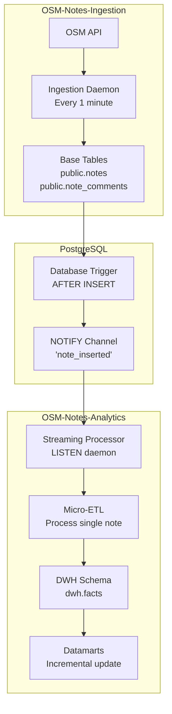

# Real-Time Streaming Analytics Implementation Plan

**Version**: 1.0  
**Date**: 2025-01-21  
**Status**: Future Enhancement (LOW Priority)  
**Author**: OSM-Notes-Analytics Team

---

## Executive Summary

This document outlines a plan to implement real-time streaming analytics for the OSM Notes Analytics system using PostgreSQL's **LISTEN/NOTIFY** mechanism. This would enable near-instantaneous processing of notes as they arrive, reducing latency from the current 15 minutes to seconds.

**Current State**: 
- Ingestion: Daemon runs every minute
- ETL: Runs every 15 minutes
- **Latency**: ~15 minutes maximum

**Proposed State**:
- Ingestion: Daemon runs every minute + sends NOTIFY on insert
- Streaming Processor: LISTENs for notifications and processes immediately
- **Latency**: Seconds to minutes

---

## Table of Contents

1. [Overview](#overview)
2. [Architecture](#architecture)
3. [PostgreSQL LISTEN/NOTIFY Mechanism](#postgresql-listennotify-mechanism)
4. [Implementation Details](#implementation-details)
5. [Code Examples](#code-examples)
6. [Integration Points](#integration-points)
7. [Performance Considerations](#performance-considerations)
8. [Error Handling and Resilience](#error-handling-and-resilience)
9. [Monitoring and Observability](#monitoring-and-observability)
10. [Migration Strategy](#migration-strategy)
11. [Testing Strategy](#testing-strategy)
12. [Cost-Benefit Analysis](#cost-benefit-analysis)

---

## Overview

### Current Architecture

```
OSM API → Ingestion Daemon (every 1 min) → Base Tables → ETL (every 15 min) → DWH
```

**Latency**: Up to 15 minutes from note creation to DWH availability

### Proposed Architecture

```
OSM API → Ingestion Daemon (every 1 min) → Base Tables → NOTIFY
                                              ↓
                                    Streaming Processor (LISTEN)
                                              ↓
                                            DWH (real-time)
```

**Latency**: Seconds to minutes from note creation to DWH availability

### Key Benefits

1. **Reduced Latency**: Notes appear in analytics within seconds
2. **Better User Experience**: Real-time dashboards and alerts
3. **Event-Driven**: Processes only when new data arrives
4. **Efficient**: Uses native PostgreSQL features (no external message queue needed)
5. **Scalable**: Can handle bursts of activity

### Trade-offs

1. **Complexity**: Additional service to maintain
2. **Resource Usage**: Continuous connection to database
3. **Error Recovery**: More complex failure scenarios
4. **Testing**: More complex testing requirements

---

## Architecture

### High-Level Architecture



### Component Details

#### 1. Database Trigger (Ingestion Side)

A PostgreSQL trigger that fires `NOTIFY` when new notes or comments are inserted:

```sql
CREATE OR REPLACE FUNCTION notify_note_insert()
RETURNS TRIGGER AS $$
BEGIN
    PERFORM pg_notify('note_inserted', json_build_object(
        'note_id', NEW.note_id,
        'sequence_action', NEW.sequence_action,
        'event', NEW.event,
        'created_at', NEW.created_at
    )::text);
    RETURN NEW;
END;
$$ LANGUAGE plpgsql;

CREATE TRIGGER note_insert_notify
    AFTER INSERT ON public.note_comments
    FOR EACH ROW
    EXECUTE FUNCTION notify_note_insert();
```

#### 2. Streaming Processor (Analytics Side)

A daemon process that:
- Maintains a persistent connection to PostgreSQL
- LISTENs to the `note_inserted` channel
- Processes notifications as they arrive
- Handles errors and reconnection

#### 3. Micro-ETL

A lightweight ETL process that:
- Processes a single note/comment
- Updates dimensions if needed
- Inserts fact row
- Updates affected datamarts incrementally

---

## PostgreSQL LISTEN/NOTIFY Mechanism

### How It Works

PostgreSQL's LISTEN/NOTIFY is a built-in pub/sub mechanism:

1. **LISTEN**: A client subscribes to a channel
2. **NOTIFY**: A process sends a message to a channel
3. **Notification**: All LISTENing clients receive the message

### Advantages

- **Native**: Built into PostgreSQL, no external dependencies
- **Efficient**: Low overhead, uses existing database connection
- **Reliable**: Transactions ensure notifications are delivered
- **Simple**: No message queue infrastructure needed

### Limitations

- **Payload Size**: Limited to 8000 bytes (use JSON for structured data)
- **No Persistence**: Notifications are lost if no listeners are active
- **No Acknowledgment**: No built-in delivery confirmation
- **Connection Required**: Requires persistent database connection

### Channel Design

We'll use multiple channels for different event types:

```sql
-- New note comment inserted
'note_inserted'

-- Note status changed (opened/closed/reopened)
'note_status_changed'

-- Bulk import completed (for initial loads)
'bulk_import_completed'
```

### Notification Payload Format

JSON structure for `note_inserted`:

```json
{
  "note_id": 12345,
  "sequence_action": 1,
  "event": "opened",
  "created_at": "2025-01-21T10:30:00Z",
  "id_user": 67890,
  "id_country": 42
}
```

---

## Implementation Details

### Phase 1: Database Setup (Ingestion Side)

#### Step 1.1: Create Notification Function

```sql
-- File: sql/ingestion/notify_note_insert.sql
-- This should be added to OSM-Notes-Ingestion project

CREATE OR REPLACE FUNCTION public.notify_note_insert()
RETURNS TRIGGER AS $$
DECLARE
    v_payload JSONB;
BEGIN
    -- Build notification payload
    v_payload := jsonb_build_object(
        'note_id', NEW.note_id,
        'sequence_action', NEW.sequence_action,
        'event', NEW.event,
        'created_at', NEW.created_at::text,
        'id_user', NEW.id_user,
        'table_name', TG_TABLE_NAME
    );
    
    -- Send notification
    PERFORM pg_notify('note_inserted', v_payload::text);
    
    RETURN NEW;
END;
$$ LANGUAGE plpgsql;

COMMENT ON FUNCTION public.notify_note_insert() IS
    'Sends NOTIFY to note_inserted channel when new note comments are inserted';
```

#### Step 1.2: Create Trigger

```sql
-- File: sql/ingestion/create_note_notify_trigger.sql

-- Drop existing trigger if it exists
DROP TRIGGER IF EXISTS note_insert_notify ON public.note_comments;

-- Create trigger
CREATE TRIGGER note_insert_notify
    AFTER INSERT ON public.note_comments
    FOR EACH ROW
    WHEN (NEW.event IN ('opened', 'closed', 'reopened', 'commented'))
    EXECUTE FUNCTION public.notify_note_insert();

COMMENT ON TRIGGER note_insert_notify ON public.note_comments IS
    'Notifies analytics system when new note events occur';
```

#### Step 1.3: Enable Notifications (Optional Configuration)

```sql
-- Check if notifications are enabled
SHOW max_listener_connections;

-- Default is usually sufficient, but can be increased if needed
-- ALTER SYSTEM SET max_listener_connections = 100;
```

### Phase 2: Streaming Processor (Analytics Side)

#### Step 2.1: Create Streaming Processor Script

```bash
#!/bin/bash
# File: bin/dwh/streaming_processor.sh

# Streaming processor for real-time note processing using LISTEN/NOTIFY

set -euo pipefail

# Source common functions
SCRIPT_DIR="$(cd "$(dirname "${BASH_SOURCE[0]}")" && pwd)"
source "${SCRIPT_DIR}/../../etc/properties.sh" || exit 1
source "${SCRIPT_DIR}/../../lib/osm-common/logging.sh" || exit 1

# Configuration
CHANNEL="note_inserted"
RECONNECT_DELAY=5
MAX_RECONNECT_ATTEMPTS=10
BATCH_SIZE=10
BATCH_TIMEOUT=5  # seconds

# Logging
LOG_DIR="${LOG_DIR:-/tmp/streaming_processor}"
mkdir -p "${LOG_DIR}"
LOG_FILE="${LOG_DIR}/streaming_processor_$(date +%Y%m%d_%H%M%S).log"

__log_start() {
    echo "[$(date +'%Y-%m-%d %H:%M:%S')] Starting streaming processor..." | tee -a "${LOG_FILE}"
}

__log_notification() {
    local note_id=$1
    local payload=$2
    echo "[$(date +'%Y-%m-%d %H:%M:%S')] Received notification: note_id=${note_id}" | tee -a "${LOG_FILE}"
}

__log_error() {
    echo "[$(date +'%Y-%m-%d %H:%M:%S')] ERROR: $1" | tee -a "${LOG_FILE}" >&2
}

__log_finish() {
    echo "[$(date +'%Y-%m-%d %H:%M:%S')] Streaming processor stopped." | tee -a "${LOG_FILE}"
}

# Process a single notification
process_notification() {
    local payload=$1
    local note_id=$(echo "${payload}" | jq -r '.note_id')
    local sequence_action=$(echo "${payload}" | jq -r '.sequence_action')
    
    __log_notification "${note_id}" "${payload}"
    
    # Call micro-ETL to process this note
    "${SCRIPT_DIR}/micro_etl.sh" \
        --note-id "${note_id}" \
        --sequence-action "${sequence_action}" \
        2>&1 | tee -a "${LOG_FILE}"
    
    return $?
}

# Main LISTEN loop
listen_loop() {
    local reconnect_count=0
    
    while true; do
        __log_start
        
        # Connect and LISTEN
        psql -d "${DBNAME_DWH}" \
            -c "LISTEN ${CHANNEL};" \
            -c "SELECT pg_notify('test', 'Streaming processor connected');" \
            || {
                __log_error "Failed to connect to database"
                reconnect_count=$((reconnect_count + 1))
                if [ ${reconnect_count} -ge ${MAX_RECONNECT_ATTEMPTS} ]; then
                    __log_error "Max reconnection attempts reached. Exiting."
                    exit 1
                fi
                sleep ${RECONNECT_DELAY}
                continue
            }
        
        # Reset reconnect count on successful connection
        reconnect_count=0
        
        # Use pg_notify_listen or similar tool to receive notifications
        # For bash, we'll use a Python helper script
        "${SCRIPT_DIR}/listen_helper.py" \
            --dbname "${DBNAME_DWH}" \
            --channel "${CHANNEL}" \
            --batch-size "${BATCH_SIZE}" \
            --batch-timeout "${BATCH_TIMEOUT}" \
            --callback "${SCRIPT_DIR}/process_batch.sh" \
            2>&1 | tee -a "${LOG_FILE}"
        
        # If we get here, the listener exited (error or shutdown)
        __log_error "Listener exited. Reconnecting in ${RECONNECT_DELAY} seconds..."
        sleep ${RECONNECT_DELAY}
    done
}

# Signal handling
trap '__log_finish; exit 0' SIGTERM SIGINT

# Start listening
listen_loop
```

#### Step 2.2: Python LISTEN Helper

```python
#!/usr/bin/env python3
# File: bin/dwh/listen_helper.py

"""
PostgreSQL LISTEN helper for receiving notifications.

This script maintains a persistent connection and listens for NOTIFY events,
batching them for efficient processing.
"""

import argparse
import json
import psycopg2
import psycopg2.extensions
import select
import subprocess
import sys
import time
from datetime import datetime
from typing import List, Dict

def log(message: str):
    """Log with timestamp."""
    print(f"[{datetime.now().strftime('%Y-%m-%d %H:%M:%S')}] {message}", flush=True)

def process_notifications(
    conn: psycopg2.extensions.connection,
    channel: str,
    batch_size: int,
    batch_timeout: float,
    callback_script: str
):
    """Listen for notifications and process them in batches."""
    
    # Set up connection for async notifications
    conn.set_isolation_level(psycopg2.extensions.ISOLATION_LEVEL_AUTOCOMMIT)
    
    # Create cursor
    cur = conn.cursor()
    
    # Listen to channel
    cur.execute(f"LISTEN {channel};")
    log(f"Listening on channel: {channel}")
    
    # Notification buffer
    notifications: List[Dict] = []
    last_batch_time = time.time()
    
    while True:
        # Check for notifications
        if select.select([conn], [], [], batch_timeout)[0]:
            conn.poll()
            
            while conn.notifies:
                notify = conn.notifies.pop(0)
                
                try:
                    payload = json.loads(notify.payload)
                    notifications.append({
                        'channel': notify.channel,
                        'payload': notify.payload,
                        'pid': notify.pid,
                        'data': payload
                    })
                    
                    log(f"Received notification: note_id={payload.get('note_id', 'unknown')}")
                    
                except json.JSONDecodeError as e:
                    log(f"ERROR: Failed to parse notification payload: {e}")
                    continue
        
        # Process batch if ready
        current_time = time.time()
        should_process = (
            len(notifications) >= batch_size or
            (len(notifications) > 0 and (current_time - last_batch_time) >= batch_timeout)
        )
        
        if should_process:
            if notifications:
                log(f"Processing batch of {len(notifications)} notifications")
                
                # Call callback script with batch
                try:
                    result = subprocess.run(
                        [callback_script],
                        input=json.dumps(notifications),
                        text=True,
                        capture_output=True,
                        timeout=300  # 5 minute timeout per batch
                    )
                    
                    if result.returncode != 0:
                        log(f"ERROR: Callback script failed: {result.stderr}")
                    else:
                        log(f"Successfully processed {len(notifications)} notifications")
                        
                except subprocess.TimeoutExpired:
                    log(f"ERROR: Callback script timed out after 5 minutes")
                except Exception as e:
                    log(f"ERROR: Failed to execute callback: {e}")
                
                # Clear buffer
                notifications = []
                last_batch_time = current_time

def main():
    parser = argparse.ArgumentParser(description='PostgreSQL LISTEN helper')
    parser.add_argument('--dbname', required=True, help='Database name')
    parser.add_argument('--channel', required=True, help='Channel to listen on')
    parser.add_argument('--batch-size', type=int, default=10, help='Batch size')
    parser.add_argument('--batch-timeout', type=float, default=5.0, help='Batch timeout in seconds')
    parser.add_argument('--callback', required=True, help='Callback script to process batches')
    
    args = parser.parse_args()
    
    # Connect to database
    try:
        conn = psycopg2.connect(
            dbname=args.dbname,
            user=os.getenv('DB_USER', 'postgres'),
            password=os.getenv('DB_PASSWORD', ''),
            host=os.getenv('DB_HOST', 'localhost'),
            port=os.getenv('DB_PORT', '5432')
        )
        log("Connected to database")
    except Exception as e:
        log(f"ERROR: Failed to connect to database: {e}")
        sys.exit(1)
    
    try:
        process_notifications(
            conn,
            args.channel,
            args.batch_size,
            args.batch_timeout,
            args.callback
        )
    except KeyboardInterrupt:
        log("Interrupted by user")
    except Exception as e:
        log(f"ERROR: {e}")
        sys.exit(1)
    finally:
        conn.close()
        log("Connection closed")

if __name__ == '__main__':
    import os
    main()
```

#### Step 2.3: Batch Processing Script

```bash
#!/bin/bash
# File: bin/dwh/process_batch.sh

# Process a batch of notifications

set -euo pipefail

SCRIPT_DIR="$(cd "$(dirname "${BASH_SOURCE[0]}")" && pwd)"
source "${SCRIPT_DIR}/../../etc/properties.sh" || exit 1

# Read batch from stdin (JSON array)
BATCH_JSON=$(cat)

# Parse and process each notification
echo "${BATCH_JSON}" | jq -c '.[]' | while read -r notification; do
    note_id=$(echo "${notification}" | jq -r '.data.note_id')
    sequence_action=$(echo "${notification}" | jq -r '.data.sequence_action')
    
    # Process this notification
    "${SCRIPT_DIR}/micro_etl.sh" \
        --note-id "${note_id}" \
        --sequence-action "${sequence_action}"
done
```

#### Step 2.4: Micro-ETL Script

```bash
#!/bin/bash
# File: bin/dwh/micro_etl.sh

# Micro-ETL: Process a single note/comment in real-time

set -euo pipefail

SCRIPT_DIR="$(cd "$(dirname "${BASH_SOURCE[0]}")" && pwd)"
source "${SCRIPT_DIR}/../../etc/properties.sh" || exit 1

# Parse arguments
NOTE_ID=""
SEQUENCE_ACTION=""

while [[ $# -gt 0 ]]; do
    case $1 in
        --note-id)
            NOTE_ID="$2"
            shift 2
            ;;
        --sequence-action)
            SEQUENCE_ACTION="$2"
            shift 2
            ;;
        *)
            echo "Unknown option: $1"
            exit 1
            ;;
    esac
done

if [ -z "${NOTE_ID}" ] || [ -z "${SEQUENCE_ACTION}" ]; then
    echo "ERROR: --note-id and --sequence-action are required"
    exit 1
fi

# Process single note using SQL procedure
psql -d "${DBNAME_DWH}" -v ON_ERROR_STOP=1 <<EOF
-- Process single note into DWH
CALL dwh.process_single_note(
    p_note_id := ${NOTE_ID},
    p_sequence_action := ${SEQUENCE_ACTION}
);
EOF
```

### Phase 3: SQL Procedures for Micro-ETL

#### Step 3.1: Create Single Note Processing Procedure

```sql
-- File: sql/dwh/streaming/process_single_note.sql

CREATE OR REPLACE PROCEDURE dwh.process_single_note(
    p_note_id BIGINT,
    p_sequence_action INTEGER
)
LANGUAGE plpgsql
AS $$
DECLARE
    v_note_record RECORD;
    v_dimension_keys RECORD;
    v_fact_id BIGINT;
BEGIN
    -- Get note data from base tables
    SELECT 
        c.note_id,
        c.sequence_action,
        c.event AS action_comment,
        c.id_user AS action_id_user,
        c.created_at AS action_at,
        n.created_at AS note_created_at,
        n.id_user AS created_id_user,
        n.id_country,
        n.latitude,
        n.longitude,
        t.body AS comment_text
    INTO v_note_record
    FROM public.note_comments c
    JOIN public.notes n ON c.note_id = n.note_id
    LEFT JOIN public.note_comments_text t 
        ON c.note_id = t.note_id 
        AND c.sequence_action = t.sequence_action
    WHERE c.note_id = p_note_id
      AND c.sequence_action = p_sequence_action;
    
    -- If note not found, raise error
    IF NOT FOUND THEN
        RAISE EXCEPTION 'Note % sequence % not found', p_note_id, p_sequence_action;
    END IF;
    
    -- Resolve dimension keys
    SELECT 
        dwh.get_or_create_user_dimension(v_note_record.action_id_user) AS action_user_id,
        dwh.get_or_create_user_dimension(v_note_record.created_id_user) AS created_user_id,
        dwh.get_or_create_country_dimension(v_note_record.id_country) AS country_id,
        dwh.get_or_create_date_dimension(v_note_record.action_at::DATE) AS action_date_id,
        dwh.get_or_create_date_dimension(v_note_record.note_created_at::DATE) AS opened_date_id,
        dwh.get_or_create_application_dimension(
            COALESCE((v_note_record.comment_text::jsonb->>'created_by'), 'unknown')
        ) AS application_id
    INTO v_dimension_keys;
    
    -- Calculate metrics
    DECLARE
        v_comment_length INTEGER := COALESCE(LENGTH(v_note_record.comment_text), 0);
        v_has_url BOOLEAN := v_note_record.comment_text LIKE '%http%';
        v_has_mention BOOLEAN := v_note_record.comment_text LIKE '%@%';
    BEGIN
        -- Insert fact row
        INSERT INTO dwh.facts (
            id_note,
            sequence_action,
            action_comment,
            opened_dimension_id_date,
            opened_dimension_id_user,
            dimension_id_country,
            dimension_id_application_creation,
            action_dimension_id_date,
            action_dimension_id_user,
            action_at,
            comment_length,
            has_url,
            has_mention
        ) VALUES (
            v_note_record.note_id,
            v_note_record.sequence_action,
            v_note_record.action_comment,
            v_dimension_keys.opened_date_id,
            v_dimension_keys.created_user_id,
            v_dimension_keys.country_id,
            v_dimension_keys.application_id,
            v_dimension_keys.action_date_id,
            v_dimension_keys.action_user_id,
            v_note_record.action_at,
            v_comment_length,
            v_has_url,
            v_has_mention
        )
        ON CONFLICT (id_note, sequence_action) DO UPDATE SET
            action_comment = EXCLUDED.action_comment,
            action_at = EXCLUDED.action_at,
            comment_length = EXCLUDED.comment_length,
            has_url = EXCLUDED.has_url,
            has_mention = EXCLUDED.has_mention;
        
        -- Update affected datamarts incrementally
        -- (This would call incremental update procedures)
        PERFORM dwh.update_datamart_country_incremental(v_dimension_keys.country_id);
        PERFORM dwh.update_datamart_user_incremental(v_dimension_keys.action_user_id);
        
    END;
    
    COMMIT;
    
EXCEPTION
    WHEN OTHERS THEN
        ROLLBACK;
        RAISE;
END;
$$;

COMMENT ON PROCEDURE dwh.process_single_note IS
    'Processes a single note/comment into DWH in real-time';
```

---

## Integration Points

### Integration with Existing ETL

The streaming processor should work alongside the existing batch ETL:

1. **Streaming**: Handles real-time processing for immediate availability
2. **Batch ETL**: Continues to run every 15 minutes as a safety net
3. **Idempotency**: Both systems can process the same note safely (ON CONFLICT handling)

### Integration with Ingestion System

The trigger should be added to the OSM-Notes-Ingestion project:

1. **Minimal Changes**: Only add trigger, no changes to ingestion logic
2. **Optional**: Can be enabled/disabled via configuration
3. **Backward Compatible**: Doesn't affect existing ingestion functionality

---

## Performance Considerations

### Database Connection Management

- **Persistent Connection**: Streaming processor maintains one connection
- **Connection Pooling**: Consider using pgbouncer for connection management
- **Resource Limits**: Monitor connection count and adjust `max_listener_connections` if needed

### Batch Processing

- **Batch Size**: Process notifications in batches (default: 10)
- **Batch Timeout**: Process batch after timeout even if not full (default: 5 seconds)
- **Parallel Processing**: Can run multiple streaming processors for different channels

### Database Load

- **Trigger Overhead**: Minimal (just JSON building and NOTIFY)
- **Micro-ETL Load**: Similar to batch ETL but for single notes
- **Monitoring**: Track processing time and database load

### Scalability

- **Horizontal Scaling**: Can run multiple streaming processors
- **Channel Partitioning**: Use different channels for different regions/types
- **Load Balancing**: Distribute notifications across processors

---

## Error Handling and Resilience

### Connection Failures

- **Automatic Reconnection**: Retry with exponential backoff
- **Max Retries**: Limit reconnection attempts before alerting
- **Health Checks**: Periodic health check queries

### Processing Failures

- **Retry Logic**: Retry failed notifications with backoff
- **Dead Letter Queue**: Store failed notifications for manual review
- **Error Logging**: Comprehensive error logging with context

### Data Consistency

- **Idempotency**: Same note can be processed multiple times safely
- **Transaction Safety**: Use transactions for atomic operations
- **Conflict Resolution**: Handle ON CONFLICT scenarios gracefully

### Example Error Handling

```python
# In listen_helper.py

def process_notification_with_retry(payload, max_retries=3):
    for attempt in range(max_retries):
        try:
            process_notification(payload)
            return True
        except Exception as e:
            if attempt == max_retries - 1:
                # Log to dead letter queue
                log_to_dlq(payload, str(e))
                return False
            time.sleep(2 ** attempt)  # Exponential backoff
    return False
```

---

## Monitoring and Observability

### Metrics to Track

1. **Notification Rate**: Notifications received per minute
2. **Processing Rate**: Notes processed per minute
3. **Latency**: Time from notification to DWH availability
4. **Error Rate**: Failed processing attempts
5. **Connection Status**: Uptime and reconnection events
6. **Batch Statistics**: Average batch size and processing time

### Logging

- **Structured Logging**: JSON format for easy parsing
- **Log Levels**: DEBUG, INFO, WARN, ERROR
- **Context**: Include note_id, sequence_action, timestamps

### Health Checks

```bash
#!/bin/bash
# File: bin/dwh/check_streaming_health.sh

# Check if streaming processor is healthy

DBNAME="${DBNAME_DWH}"
CHANNEL="note_inserted"

# Check if processor is listening
psql -d "${DBNAME}" -c "
    SELECT count(*) as listener_count
    FROM pg_stat_activity
    WHERE state = 'active'
      AND query LIKE '%LISTEN ${CHANNEL}%';
"

# Check recent processing
psql -d "${DBNAME}" -c "
    SELECT 
        COUNT(*) as recent_facts,
        MAX(action_at) as latest_fact
    FROM dwh.facts
    WHERE action_at > NOW() - INTERVAL '5 minutes';
"
```

### Alerting

- **Connection Lost**: Alert if no connection for > 1 minute
- **High Error Rate**: Alert if error rate > 5%
- **Processing Lag**: Alert if latency > 1 minute
- **Queue Backlog**: Alert if unprocessed notifications > 100

---

## Migration Strategy

### Phase 1: Setup (Week 1)

1. Add trigger to Ingestion system (optional, can be disabled)
2. Create streaming processor infrastructure
3. Test in development environment

### Phase 2: Pilot (Week 2)

1. Enable streaming for subset of notes (e.g., specific country)
2. Run in parallel with batch ETL
3. Monitor performance and errors

### Phase 3: Gradual Rollout (Week 3-4)

1. Enable streaming for all notes
2. Keep batch ETL as safety net
3. Monitor for issues

### Phase 4: Optimization (Week 5+)

1. Tune batch sizes and timeouts
2. Optimize micro-ETL procedures
3. Consider reducing batch ETL frequency

### Rollback Plan

- **Disable Trigger**: Set trigger to disabled state
- **Stop Processor**: Gracefully shutdown streaming processor
- **Rely on Batch**: Batch ETL continues to work normally

---

## Testing Strategy

### Unit Tests

- Test notification parsing
- Test micro-ETL procedure with sample data
- Test error handling and retries

### Integration Tests

- Test full flow: Ingestion → NOTIFY → LISTEN → Process
- Test batch processing
- Test reconnection logic

### Load Tests

- Test with high notification rate
- Test with burst of notifications
- Test database connection limits

### Example Test

```bash
#!/bin/bash
# File: tests/integration/streaming_processor.test.bats

@test "Streaming processor processes notification" {
    # Insert test note
    psql -d "${TEST_DBNAME}" -c "
        INSERT INTO public.note_comments (note_id, sequence_action, event, id_user, created_at)
        VALUES (999999, 1, 'opened', 1, NOW());
    "
    
    # Wait for processing
    sleep 2
    
    # Verify fact was created
    run psql -d "${TEST_DBNAME}" -t -c "
        SELECT COUNT(*) FROM dwh.facts WHERE id_note = 999999;
    "
    
    [ "$output" -eq 1 ]
}
```

---

## Cost-Benefit Analysis

### Benefits

1. **Reduced Latency**: 15 minutes → seconds
2. **Better UX**: Real-time dashboards and alerts
3. **Event-Driven**: More efficient resource usage
4. **Scalability**: Can handle bursts better

### Costs

1. **Development**: ~20 hours initial development
2. **Maintenance**: Ongoing monitoring and maintenance
3. **Complexity**: Additional system to manage
4. **Resources**: Persistent database connection

### ROI

- **High Value**: For use cases requiring real-time data
- **Low Value**: For batch analytics that don't need real-time
- **Recommendation**: Implement if real-time is a requirement, otherwise current system is sufficient

---

## Conclusion

The LISTEN/NOTIFY approach provides a native, efficient way to implement real-time streaming analytics without external dependencies. While it adds complexity, it offers significant benefits for use cases requiring low-latency data availability.

**Recommendation**: 
- **Priority**: LOW (current 15-minute latency is acceptable for most use cases)
- **Implementation**: Consider if real-time requirements emerge
- **Alternative**: Could reduce batch ETL frequency to 5 minutes as simpler alternative

---

## References

- [PostgreSQL LISTEN/NOTIFY Documentation](https://www.postgresql.org/docs/current/sql-notify.html)
- [psycopg2 Async Notifications](https://www.psycopg.org/docs/advanced.html#asynchronous-notifications)
- [Event-Driven Architecture Patterns](https://martinfowler.com/articles/201701-event-driven.html)

---

**Last Updated**: 2025-01-21  
**Next Review**: When real-time requirements are identified

