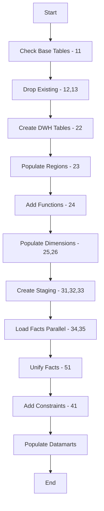
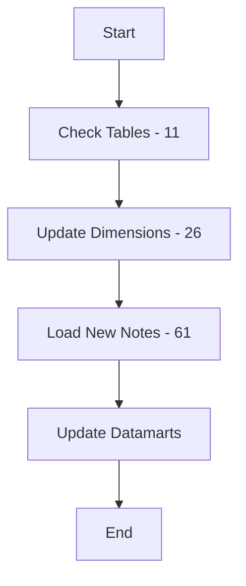

# SQL Directory

This directory contains all SQL scripts for creating, populating, and managing the data warehouse,
including the star schema, dimensions, facts, and datamarts.

## Overview

The SQL scripts implement a complete ETL (Extract, Transform, Load) pipeline that transforms raw OSM
notes data into a [star schema data warehouse](../docs/DWH_Star_Schema_ERD.md) with pre-computed datamarts for analytics.

## Directory Structure

```text
sql/
└── dwh/                                  # data warehouse SQL scripts
    ├── ETL_*.sql                         # Main ETL scripts
    ├── Staging_*.sql                     # Staging area scripts
    ├── datamarts_lastYearActivities.sql  # Last year activity aggregation
    ├── datamartCountries/                # Country datamart SQL
    │   ├── datamartCountries_11_checkDatamartCountriesTables.sql
    │   ├── datamartCountries_12_createDatamarCountriesTable.sql
    │   ├── datamartCountries_13_createProcedure.sql
    │   ├── datamartCountries_21_alterTableAddYears.sql
    │   ├── datamartCountries_31_populateDatamartCountriesTable.sql
    │   └── datamartCountries_dropDatamartObjects.sql
    └── datamartUsers/                    # User datamart SQL
        ├── datamartUsers_11_checkDatamartUsersTables.sql
        ├── datamartUsers_12_createDatamartUsersTable.sql
        ├── datamartUsers_13_createProcedure.sql
        ├── datamartUsers_21_alterTableAddYears.sql
        ├── datamartUsers_31_populateOldUsers.sql
        ├── datamartUsers_32_populateDatamartUsersTable.sql
        └── datamartUsers_dropDatamartObjects.sql
```

## Naming Convention

SQL scripts follow a structured naming pattern:

```text
<Component>_<Phase><Step>_<Description>.sql
```

- **Component**: ETL, Staging, datamartCountries, datamartUsers
- **Phase**: Numeric prefix indicating execution order
  - `1x`: Setup and validation
  - `2x`: Object creation
  - `3x`: Data population
  - `4x`: Constraints and indexes
  - `5x`: Finalization
  - `6x`: Incremental updates
- **Step**: Sequential number within phase
- **Description**: What the script does

**Examples:**

- `ETL_11_checkDWHTables.sql` - Check if DWH tables exist
- `ETL_22_createDWHTables.sql` - Create DWH dimension and fact tables
- `Staging_31_createBaseStagingObjects.sql` - Create staging objects
- `datamartCountries_31_populateDatamartCountriesTable.sql` - Populate country datamart

## Main ETL Scripts

### Phase 1: Validation and Setup (1x)

#### ETL_11_checkDWHTables.sql

**Purpose:** Validates that required base tables exist in the public schema.

**Checks:**

- `public.notes` - Note records
- `public.note_comments` - Comment records
- `public.users` - User information
- `public.countries` - Country boundaries

**Exit Behavior:** Returns error if any required table is missing.

**Usage:** Automatically called by `ETL.sh`

#### ETL_12_removeDatamartObjects.sql

**Purpose:** Drops all datamart objects (tables, procedures, functions).

**Objects Dropped:**

- `dwh.datamartCountries`
- `dwh.datamartUsers`
- Related procedures and functions

**Warning:** This is destructive! Only used during full rebuild.

**Usage:** Called by `ETL.sh` on first execution (auto-detected)

#### ETL_13_removeDWHObjects.sql

**Purpose:** Drops all DWH objects (dimensions, facts, staging).

**Objects Dropped:**

- All dimension tables
- `dwh.facts` table
- Staging schema objects
- Functions and procedures

**Warning:** This removes all data warehouse data!

**Usage:** Called by `ETL.sh` on first execution (auto-detected) for clean rebuild

### Phase 2: Object Creation (2x)

#### ETL_22_createDWHTables.sql

**Purpose:** Creates the complete [star schema structure](../docs/DWH_Star_Schema_ERD.md).

**Creates:**

1. **Schema:**
   - `dwh` schema

2. **Dimension Tables:**
   - `dimension_users` - User information with SCD2 support
   - `dimension_countries` - Country information
   - `dimension_regions` - Geographic regions
   - `dimension_continents` - Continental groupings
   - `dimension_days` - Date dimension
   - `dimension_time_of_week` - Hour/day of week dimension
   - `dimension_applications` - Applications used to create notes
   - `dimension_application_versions` - Version tracking
   - `dimension_hashtags` - Hashtags found in notes
   - `dimension_timezones` - Timezone information
   - `dimension_seasons` - Seasonal information

3. **Fact Table:**
   - `dwh.facts` - Central fact table with all note actions (see [Data Dictionary](../docs/DWH_Star_Schema_Data_Dictionary.md#table-dwhfacts) for complete column definitions)

4. **Control Tables:**
   - `dwh.properties` - ETL metadata
   - `dwh.contributor_types` - User classification types

**Key Features:**

- Surrogate keys for all dimensions
- Support for slowly changing dimensions (SCD2)
- Optimized data types
- Basic constraints (enhanced in Phase 4)

#### ETL_23_getWorldRegion.sql

**Purpose:** Populates world regions for countries.

**Creates:**

- Regional groupings (South America, Europe, Asia, etc.)
- Continental associations
- Geographic hierarchies

**Data Source:** Predefined regional classifications

#### ETL_24_addFunctions.sql

**Purpose:** Creates utility functions for ETL processing.

**Functions:**

- Date/time conversion functions
- Dimension lookup functions
- Data validation functions
- Helper utilities

#### ETL_24a_populateISOCodes.sql

**Purpose:** Creates and populates ISO country codes reference table.

**Creates:**

- `dwh.iso_country_codes` table with ~60 major countries
- Mapping from OSM country relation IDs to ISO 3166-1 codes
- Alpha-2 codes (e.g., CO, US, DE)
- Alpha-3 codes (e.g., COL, USA, DEU)

**Maintenance:**

- To add new countries, edit the INSERT statement in this file
- Countries not in the table will have NULL ISO codes (acceptable)
- See `sql/dwh/ISO_CODES_README.md` for detailed instructions

**Note:** This is a reference table, not populated from base tables. ISO codes are optional
enrichment data.

#### ETL_25_populateDimensionTables.sql

**Purpose:** Initial population of dimension tables.

**Populates:**

- `dimension_days` - Dates from 2013 to current year + 5
- `dimension_time_of_week` - All 168 hours of the week
- `dimension_applications` - Known applications
- `dimension_continents` - World continents
- `dimension_regions` - Geographic regions
- `dimension_countries` - From base tables
- `dimension_timezones` - World timezones
- `dimension_seasons` - Seasonal classifications

**Note:** `dimension_users` populated incrementally during fact loading

#### ETL_26_updateDimensionTables.sql

**Purpose:** Updates dimension tables with new data from base tables.

**Updates:**

- New users added
- Username changes (SCD2 handling)
- New countries
- Application versions

**Usage:** Called during both initial and incremental loads

### Phase 3: Staging (3x)

#### Staging_31_createBaseStagingObjects.sql

**Purpose:** Creates the staging schema and base staging objects.

**Creates:**

- `staging` schema
- Base staging tables
- Temporary processing tables

#### Staging_32_createStagingObjects.sql

**Purpose:** Creates staging procedures and functions.

**Functions/Procedures:**

- `process_notes_at_date()` - Process notes for a specific date range
- Per-year variants for parallel processing
- Dimension lookup functions
- Data transformation utilities

#### Staging_33_initialFactsBaseObjects.sql

**Purpose:** Creates year-specific staging tables for parallel processing.

**Creates:** `staging.facts_YYYY` for each year (2013-present)

**Purpose:** Allows parallel loading by year to improve performance

#### Staging_34_initialFactsLoadCreate.sql

**Purpose:** Creates procedures for loading facts for a specific year.

**Dynamic:** Year substituted via environment variable `$YEAR`

#### Staging_35_initialFactsLoadExecute.sql

**Purpose:** Executes the fact loading procedure for a specific year.

**Process:**

1. Reads notes/comments from base tables for the year
2. Resolves dimension keys
3. Computes metrics (days to resolution, etc.)
4. Loads into `staging.facts_YYYY`

**Performance:** Runs in parallel (one per year)

#### Staging_36_initialFactsLoadDrop.sql

**Purpose:** Drops staging objects after facts are loaded into main table.

**Cleanup:** Removes `staging.facts_YYYY` tables

### Phase 4: Constraints and Indexes (4x)

#### ETL_41_addConstraintsIndexesTriggers.sql

**Purpose:** Adds referential integrity, indexes, and triggers to [fact table](../docs/DWH_Star_Schema_Data_Dictionary.md#table-dwhfacts).

**Adds:**

1. **Foreign Key Constraints:**
   - Links to all dimension tables
   - Ensures referential integrity

2. **Indexes:**
   - Timestamp indexes for time-based queries
   - Dimension key indexes for joins
   - Composite indexes for common query patterns
   - Covering indexes for reporting queries

3. **Triggers:**
   - Resolution metrics calculation on insert
   - Data validation triggers
   - Audit logging triggers

**Performance Impact:** Significantly improves query performance

### Phase 5: Finalization (5x)

#### Staging_51_unify.sql

**Purpose:** Unifies facts across years and computes cross-year metrics.

**Process:**

1. Copies facts from all `staging.facts_YYYY` to `dwh.facts`
2. Computes metrics that span years
3. Fills in `recent_opened_dimension_id_date` for all facts
4. Validates data consistency

**Critical:** Must run after all year-specific loads complete

### Phase 6: Incremental Updates (6x)

#### Staging_61_loadNotes.sql

**Purpose:** Loads new notes incrementally (for scheduled updates).

**Process:**

1. Identifies notes added since last ETL run
2. Processes only new note actions
3. Updates dimensions if needed
4. Appends to [fact table](../docs/DWH_Star_Schema_Data_Dictionary.md#table-dwhfacts)

**Performance:** Much faster than full reload (minutes vs hours)

## Datamart Scripts

### Country Datamart

Location: `sql/dwh/datamartCountries/`

#### datamartCountries_11_checkDatamartCountriesTables.sql

Validates that country datamart prerequisites exist.

#### datamartCountries_12_createDatamarCountriesTable.sql

Creates `dwh.datamartCountries` table with:

- Country-level aggregates
- Yearly history (2013-present)
- Current/monthly/daily statistics
- Rankings and leaderboards
- Activity patterns

#### datamartCountries_13_createProcedure.sql

Creates stored procedure to populate the country datamart.

**Procedure:** `dwh.populate_datamart_countries()`

#### datamartCountries_21_alterTableAddYears.sql

Dynamically adds columns for new years as time passes.

**Example:** Adds `history_2026_open` column in 2026

#### datamartCountries_31_populateDatamartCountriesTable.sql

Main population script that:

1. Aggregates facts by country
2. Computes all metrics
3. Generates rankings
4. Calculates working hours patterns
5. Updates all rows

**Execution Time:** ~20 minutes

#### datamartCountries_dropDatamartObjects.sql

Cleanup script to remove all country datamart objects.

### User Datamart

Location: `sql/dwh/datamartUsers/`

#### datamartUsers_11_checkDatamartUsersTables.sql

Validates user datamart prerequisites.

#### datamartUsers_12_createDatamartUsersTable.sql

Creates `dwh.datamartUsers` table with:

- User-level aggregates
- Yearly history per user
- Contribution patterns
- Country rankings
- Activity classifications

#### datamartUsers_13_createProcedure.sql

Creates procedures for incremental user datamart updates.

**Procedures:**

- `dwh.populate_datamart_users(user_id)` - Single user
- `dwh.populate_datamart_users_batch()` - Batch of 500 users

#### datamartUsers_21_alterTableAddYears.sql

Adds year columns for user datamart as needed.

#### datamartUsers_31_populateOldUsers.sql

Pre-processes users with minimal activity for efficiency.

#### datamartUsers_32_populateDatamartUsersTable.sql

Main incremental population script:

1. Processes 500 users per run
2. Marks users as processed
3. Computes all user metrics
4. Generates country rankings

**Design:** Incremental to avoid overwhelming database

### Utility Scripts

#### datamarts_lastYearActivities.sql

Computes last year activity patterns (GitHub-style contribution graph).

**Used By:** Both country and user datamarts

## Execution Flow

### Initial Load (first execution - auto-detected)

**For detailed ETL process documentation, see [ETL Enhanced Features](../docs/ETL_Enhanced_Features.md).**



### Incremental Update (subsequent executions - auto-detected)



**For complete ETL flow documentation, see:**
- [ETL Enhanced Features](../docs/ETL_Enhanced_Features.md) - ETL capabilities and features
- [bin/dwh/README.md](../bin/dwh/README.md#etl-flow-high-level) - High-level ETL overview

## Database Schema

### Star Schema Overview

The data warehouse uses a **star schema design** with:
- **Fact Table**: `dwh.facts` - One row per note action (partitioned by year)
- **Dimension Tables**: Users, countries, dates, times, applications, hashtags, and more
- **Datamart Tables**: Pre-computed analytics for users and countries

**For complete schema documentation:**
- **[DWH Star Schema ERD](../docs/DWH_Star_Schema_ERD.md)** - Complete entity-relationship diagram with all relationships and cardinalities
- **[Data Dictionary](../docs/DWH_Star_Schema_Data_Dictionary.md)** - Detailed column definitions for all tables

### Table Sizes (Approximate)

- `dwh.facts` - ~20M+ rows (depends on notes volume)
- `dimension_users` - ~500K rows
- `dimension_countries` - ~200 rows
- `dimension_days` - ~5K rows (2013-2030)
- `dimension_time_of_week` - 168 rows
- `dwh.datamartCountries` - ~200 rows
- `dwh.datamartUsers` - ~500K rows

## Performance Considerations

### Parallel Processing

- Facts loaded in parallel by year (2013-present)
- Each year runs as separate job
- Typically 12-13 parallel jobs
- Requires sufficient CPU/memory

### Indexing Strategy

- B-tree indexes on foreign keys
- Covering indexes for common queries
- Partial indexes for recent data
- GiST indexes for geographic queries

### Optimization Tips

1. **Increase work_mem for loading:**

   ```sql
   SET work_mem = '256MB';
   ```

1. **Disable autovacuum during initial load:**

   ```sql
   ALTER TABLE dwh.facts SET (autovacuum_enabled = false);
   -- Re-enable after load
   ALTER TABLE dwh.facts SET (autovacuum_enabled = true);
   ```

1. **Run VACUUM ANALYZE after load:**

   ```sql
   VACUUM ANALYZE dwh.facts;
   ```

## Testing SQL

### Syntax Validation

```bash
# Validate SQL syntax
for file in sql/dwh/*.sql; do
  psql -d postgres -f "$file" --dry-run 2>&1 | grep -i error
done
```

### Test Execution

```bash
# Test single script
psql -d dwh -f sql/dwh/ETL_22_createDWHTables.sql

# Check for errors
echo $?  # Should be 0
```

### Query Testing

```sql
-- Test dimension population
SELECT COUNT(*) FROM dwh.dimension_users;

-- Test fact table
SELECT COUNT(*) FROM dwh.facts;

-- Test referential integrity
SELECT COUNT(*)
FROM dwh.facts f
LEFT JOIN dwh.dimension_users u
  ON f.action_dimension_id_user = u.dimension_user_id
WHERE u.dimension_user_id IS NULL;
-- Should return 0
```

## Troubleshooting

### "Relation does not exist"

Check schema search path:

```sql
SHOW search_path;
SET search_path TO dwh, public;
```

### "Out of memory" during load

Reduce batch size or parallel jobs:

```bash
# Edit etc/etl.properties
ETL_BATCH_SIZE=500
ETL_MAX_PARALLEL_JOBS=2
```

### Slow queries

Analyze tables:

```sql
ANALYZE dwh.facts;
ANALYZE dwh.dimension_users;
```

Check missing indexes:

```sql
SELECT schemaname, tablename, attname, n_distinct, correlation
FROM pg_stats
WHERE schemaname = 'dwh' AND tablename = 'facts';
```

### Lock conflicts

Check for locks:

```sql
SELECT pid, usename, query, state
FROM pg_stat_activity
WHERE datname = 'osm_notes' AND state != 'idle';
```

Kill blocking queries:

```sql
SELECT pg_terminate_backend(pid);
```

## Best Practices

1. **Always backup before major changes:**

   ```bash
   pg_dump -d osm_notes -n dwh > dwh_backup.sql
   ```

1. **Test scripts in development database first**

1. **Use transactions for data modifications:**

   ```sql
   BEGIN;
   -- Your changes
   ROLLBACK; -- or COMMIT;
   ```

1. **Monitor long-running queries:**

   ```sql
   SELECT pid, now() - pg_stat_activity.query_start AS duration, query
   FROM pg_stat_activity
   WHERE state = 'active' AND now() - pg_stat_activity.query_start > interval '5 minutes';
   ```

1. **Document complex queries with comments**

## Related Documentation

### Essential Reading

- **[DWH Star Schema ERD](../docs/DWH_Star_Schema_ERD.md)** - Visual schema diagrams
- **[Data Dictionary](../docs/DWH_Star_Schema_Data_Dictionary.md)** - Complete column definitions
- **[ETL Enhanced Features](../docs/ETL_Enhanced_Features.md)** - ETL capabilities and features

### Scripts and Execution

- **[bin/dwh/ETL.sh](../bin/dwh/ETL.sh)** - Main ETL orchestration script
- **[bin/dwh/ENTRY_POINTS.md](../bin/dwh/ENTRY_POINTS.md)** - Script entry points
- **[bin/README.md](../bin/README.md)** - Script usage guide

### Configuration

- **[etc/README.md](../etc/README.md)** - Configuration files and ETL properties
- **[bin/dwh/ENVIRONMENT_VARIABLES.md](../bin/dwh/ENVIRONMENT_VARIABLES.md)** - Environment variables

### Maintenance and Troubleshooting

- **[DWH Maintenance Guide](../docs/DWH_Maintenance_Guide.md)** - Maintenance procedures
- **[Troubleshooting Guide](../docs/Troubleshooting_Guide.md)** - Common SQL and database issues
- **[partitioning_strategy.md](../docs/partitioning_strategy.md)** - Facts table partitioning

### External References

- [PostgreSQL Documentation](https://www.postgresql.org/docs/)
- [PostGIS Documentation](https://postgis.net/documentation/)

## References

- [DWH Star Schema ERD](../docs/DWH_Star_Schema_ERD.md)
- [Data Dictionary](../docs/DWH_Star_Schema_Data_Dictionary.md)
- [ETL Enhanced Features](../docs/ETL_Enhanced_Features.md)
- [PostgreSQL Documentation](https://www.postgresql.org/docs/)

## Support

For SQL-related issues:

1. Check PostgreSQL logs
1. Review query execution plans: `EXPLAIN ANALYZE`
1. Check for table bloat: `pg_stat_user_tables`
1. Create an issue with query and error message
